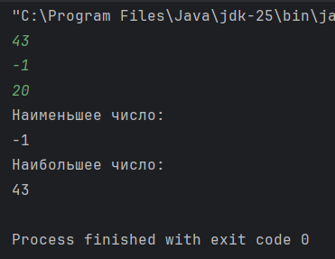

# ДЗ №1 (с 21.09.25 до 28.09.25)

---

---

### Задание №1

Для выполнения практических домашних заданий нам понадобится необходимое Программое Обеспечение (ПО) на ваших домашних копьютерах.

Для это необходимо:

- **Установить язык программирования Java**
- **Установить среду разработки IntelliJ IDEA**
- **Настроить IntelliJ IDEA**

Чтобы все сделать правильно, советую выполнять все действия по подготовленному [**гайду**](./../Установка_ПО/Установка_ПО.md) вместе с родителями. Если возникают какие-то сложности, нужно попросить родителей обратиться к преподавателю в чате в WhatsApp.

---

---

### Задание №2

В созданном, после установки и настройки ПО, проекте напишем свою первую программу, которая будет находить **минимальное** _(самое маленькое)_ и **максимальное** _(самое большое)_ число из трех.

Представим, что у нас есть числа `a`, `b` и `c`

##### Как найти минимальное?

Число `a` будет минимальным, если оно **меньше чем `b` и меньше чем `c`**

##### Как найти максимальное?

Аналогично, число `a` будет максимальным, если оно **больше чем `b` и больше чем `c`**

---

#### Как будет выглядеть программа:

```Java
import java.util.Scanner;

public class Main {
    public static void main(String[] args) {
        // Объявление переменной scanner типа Scanner для ввода переменных через консоль
        Scanner scanner = new Scanner(System.in);
        
        // Ввод переменной "a" через консоль
        int a = scanner.nextInt();
        // Ввод переменной "b" через консоль 
        // Ввод переменной "c" через консоль 

        System.out.println("Наименьшее число:");
        // Конструкция if - else if - else
        if (a <= b && a <= c) { // Проверка, что "a" наименьшее
            // Вывод переменной "a"
        } else if (...) { // Проверка, что "b" наименьшее
            // Вывод переменной "b"
        } else {
            // Вывод переменной "c"
        }

        System.out.println("Наибольшее число:");
        // Аналогичная конструкция if - else if - else для поиска наибольшего числа
    }
}
```

---

#### Что нужно вспомнить, чтобы выполнить задание:
- Как объявлять переменные (есть пример)
- Как вводить значения переменных через консоль (есть пример)
- Структуру консткрукции `if - else if - else` (есть пример)
- Как выводить переменные к консоль (есть пример)
- Логические операторы `<`, `>`, `<=`, `>=`
- Логические операторы `&&` (логическое И), `||` (логическое ИЛИ)

Задание со `*`:
- Вспомнить для чего используется 

---

#### Что должно получиться:

После запуска написанной программы, в консоль (в нижней части среды разработки), нужно ввести 3 числа:

- Ввел число - нажал "Enter"
- Ввел следующие число - нажал "Enter"
- Ввел третье число - нажал "Enter"

По итогу в консоль должно вывестить следующее:



---

#### Дополнительно
Строчки, начинающиеся с `//`, называются **комментариями** - они "игнорируются компьютером" и не влияют на ход выполнения программы. Их можно оставить или удалить