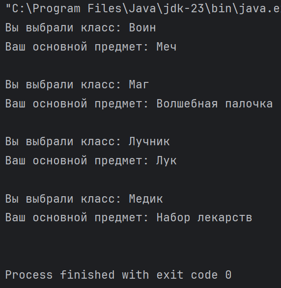
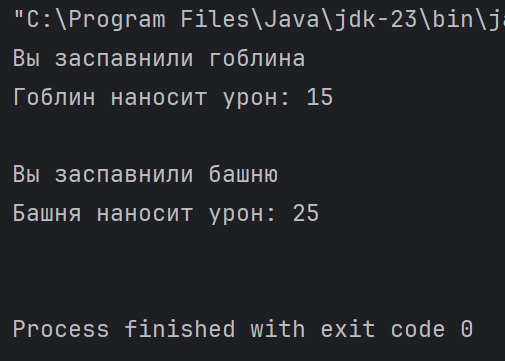

# ДЗ №13 (с 14.12.25 до 21.12.25)

---

---

### Задание №1

Представим, что мы реализуем RGP (_role-playing game; ролевая игра_), в которой первым делом игрок должен выбрать один из предложенных ему классов:

- Воин (warrior)
- Маг (wizard)
- Лучник (archer)
- Медик (healer)

У каждого класс есть свой уникальный старторый предмет.

- Воин - мечь (sword)
- Маг - волшебная палочка (magic_wand)
- Лучник - лук (bow)
- Медик - набор медикаментов (medicine_set)

---

**Что нужно сделать:**

- Написать enum (_от англ "enumeration" - "перечисление"_) playerClass, который содержит класс игрока для выбора
- Дописать в уже существующем методе setPlayerClass конструкцию switch-case с использованием значений из написанного enum в зависимости от описания случаев (кейсов)

---

**Код для тестирования:**

```java
public class Main {
    public static void main(String[] args) {

        Goblin hero = new Goblin();
        for (playerClass pc: playerClass.values()) {
            hero.setPlayerClass(pc);
            System.out.println();
        }
    }
}


class Goblin {
    private playerClass player_class;
    private playerItem  player_item;

    private void setPlayerItem(playerItem playeritem) {
        System.out.print("Ваш основной предмет: ");
        switch (playeritem) {
            case playerItem.SWORD -> System.out.println("Меч");
            case playerItem.MAGIC_WAND -> System.out.println("Волшебная палочка");
            case playerItem.BOW -> System.out.println("Лук");
            case playerItem.MEDICINE_SET -> System.out.println("Набор лекарств");
        }
        this.player_item = playeritem;
    }

    public void setPlayerClass(playerClass playerclass) {
        System.out.print("Вы выбрали класс: ");
        switch (playerclass) {
            case :
                System.out.println("Воин");
                this.setPlayerItem(playerItem.SWORD);
                break;
            case :
                System.out.println("Маг");
                this.setPlayerItem(playerItem.MAGIC_WAND);
                break;
            case :
                System.out.println("Лучник");
                this.setPlayerItem(playerItem.BOW);
                break;
            case :
                System.out.println("Медик");
                this.setPlayerItem(playerItem.MEDICINE_SET);
                break;
        }
        this.player_class = playerclass;
    }
}

enum playerItem {SWORD, MAGIC_WAND, BOW, MEDICINE_SET}
// playerClass

```

---

**Пояснение:**

- Класс Main выполнит автоматический перебор всех добавленных в playerClass значений и вызовет метод setPlayerClass, передав по очереди каждое значение
- Класс Goblin:
  - Есть поля player_class и player_item, в которые просто запишутся класс и уникальный предмет игрока
  - Метод setPlayerItem присвоит игроку уникальный предмет и выведет в консоль сообщение о том, какой именно предмет (**метод изменять не нужно**)
  - Метод setPlayerClass присвоит игроку выбранный класс и выведет в консоль сообщение о том, какой именно класс был выбран (**метод нужно дописать**) 
- Перечисление (enum) playerItem содержит названия уникальных предметов (**не нужно изменять**)
- Перечисление playerClass должно содержать названия классов игрока (**нужно написать самостоятельно**)

---

**Подсказки:**

- Чтобы вспомнить, как правильно написать перечисление playerClass можете смотреть на перечисление playerItem
- Чтобы правильно дописать switch-case в методе setPlayerClass смотрите на аналогичную switch-case конструкцию в методе setPlayerItem

---

**Если все сделано правильно, должно получиться следующее:**



---

---

### Задание №2

Интерфейсы... Попробуем реализовать что-то на подобии колоды в Clash Royale / Clash of Clans.

Абстрагируемся от того, как в действительности реализована сборка колоды в подобных играх, и представим, что колода - это массив, а карты это экземпляры разных классов, которые туда помещаются. Возникает некоторая сложность, потому что массив, как мы знаем, может содержать только разные экземпляры одно и того же класса, т.е. мы просто не сможем записать в один массив класс скелетов и класс гоблинов.

Интерфейсы как раз решают эту проблему. В интерфейсе мы описываем, какие основные методы должны иметь наши "карты", после чего на основе этого интерфейса создаем нужные классы карт и в самом конце создаем массив, который может содержать любые классы, которые сделаны на основе интерфейса.

---

**Что нужно сделать:**

Дописать в интерфейс Attacker все необходимые методы наших карт-классов.

---

**Код для тестирования:**

```java
public class Main {
    public static void main(String[] args) {

        Attacker[] attackers = {
                new Goblin(),
                new Tower()
        };

        for (Attacker attacker : attackers) {
            attacker.summon();
            System.out.printf("%s наносит урон: %s\n\n", attacker.getName(), attacker.getDamage());
        }
    }
}

interface Attacker {
    // нужно дописать методы
}

class Goblin implements Attacker {
    public void summon() {
        System.out.println("Вы заспавнили гоблина");
    }

    public int getDamage() {
        return 15;
    }

    public String getName() {
        return "Гоблин";
    }
}

class Tower implements Attacker {
    public void summon() {
        System.out.println("Вы заспавнили башню");
    }

    public int getDamage() {
        return 25;
    }

    public String getName() {
        return "Башня";
    }
}
```

---

**Пояснение:**

- В классе Main создается массив, в котором могут находится любые классы написанные на основе интерфейса Attacker. В массив записываются два новых экземпляра разных классов (Goblin и Tower), реализованных по интерфейсу. После чего у каждого экземляра автоматически вызываются все описанные в нем методы: summon (призвать), getName (получить название), getDamage (получить численное количество урона, которое наносит юнит)
- Классы Goblin и Tower реализованы (implements) по интрерфейсу Attacker и содержат методы: 
  - public void summon()
  - public int getDamage()
  - public String getName()
- Интерфейс Attacker описываем методы, которые должны содержать классы Goblin и Tower, т.е. там должно быть только описание нужных методов - тип `public` или `private`, возвращаемое значение, название метода, параметры метода (**нужно дописать**)

---

**Подсказка:**

Всё, что нужно дописать в интерфейс, уже написано в самом задании.

---

**Если все сделано правильно, должно получиться следующее:**



---

---

### Задание 2.2

По аналогии с классами Goblin и Tower напишите свой класс, который реализует интерфейс Attacker. Создайте экземпляр вашего класса в массиве в классе Main, где созданы экземпляры классов Goblin и Tower. Запустить программу и посмотрите, что получается.