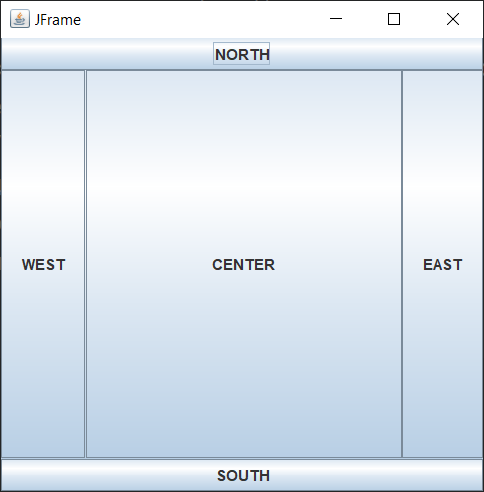

# ДЗ №16 (с 25.01.26 до 01.02.26)

---

---

### Введение

На занятии мы повторили, что делает ключевое слово `import`, и поговорили, что такое пакеты (библиотеки), и что такое `*` при импорте пакетов

Начали изучать библиотеку swing, которая позволяет создавать графический интерфейс. Мы разобрались с некоторыми основными элементами:
- Главное окно: `JFrame`
  - Научились задавать название окна
  - Научились изменять размеры окна
  - Научились задавать параметры закрытия окна
- Текстовый заголовок: `JLabel`
  - Научились задавать изначальный текст
  - Научились изменять текст
- Поле для ввода: `JTextField`
  - Научились считывать введенный текст для работы с ним
- Кнопка: `JButton`
  - Научились выполнять некоторые действия по нажатии

Также разобрались, что обычном frame элементы можно размещаться в 5 местах, обозначенных сторонами света:
- `NORTH` - север / верх
- `SOUTH` - юг / низ
- `WEST` - запад / лево
- `EAST` - восток / право
- `CENTER` - центр



Обсудили, что такое лямбда-функции, которые используются при выполнении кода по нажатии кнопок. И в качестве практики написали простенький кликер.

---

---

### Задание №1

Попробуем создать простенькое меню игры с:
- Названием игры
- Сообщением, что игроку нужно ввести ник (игровое имя)
- Полем для ввода ника
- Кнопку для запуска игры

---

1) Импортируем необходимые библиотеки:

```java
import javax.swing.*;
import java.awt.*;
```

---

2) Создаем точку входа в программу (класс Main и метод `main`):

```java
public class Main {
    public static void main(String[] args) {
        
    }
}
```

---

3) Основные элементы графического интерфейса:

Внутри метода `main` необходимо создать:
- Главное окно:
  - Задать ему название при создании
  - Установить окну размер на ваше усмотрение
  - Установить параметр завершения всей программы при закрытии: `.setDefaultCloseOperation(JFrame.EXIT_ON_CLOSE);`
- Текстовый заголовок с названием игры:
  - Задать название игры при создании
  - Расположить вверху (на севере - `NORTH`)
- Текстовый заголовок с сообщением для игрока:
  - Задать изначальный текст, например `"Введите ник:"`
  - Расположить в центре (`CENTER`)
- Поле для ввода:
  - Расположить снизу (на юге - `SOUTH`)
- Кнопку:
  - Задать изначальный текст, например `"Начать игру"`
  - Расположить справа (на востоке - `EAST`)

---

Чтобы создать элемент необходимо создать переменную с типом элемента, который добавляем, после чего через оператор `new` записать в нее новый экземпляр класса элемента. На примере текстового заголовка:

```java
JLabel messageLabel = new JLabel("Введите ник:");
```

- `JLabel` - тип переменной
- `messageLabel` - название переменной
- `=` - записываем в переменную слева то, что находится справа
- `new JLabel()` - создаем новый экземпляр класса JLabel
- `"Введите ник:"` - изначальный текст в заголовке

Необходимые типы переменных: `JFrame`, `JLabel`, `JTextField`, `JButton`

---

Чтобы настроить размер ранее созданного `JFrame` (основное окно) необходимо у переменной, в которую записано окно, вызвать метод `.setSize()` _(set - установить, Size - размер)_. В параметрах метода необходимо передать размер по ширине _(width)_ и по высоте _(height)_. Пример:

```java
frame.setSize(400, 300);
```

_(`frame` - переменная, в которую записано окно)_

---

Чтобы добавить новый элемент в ранее созданный `JFrame` (основное окно) необходимо у переменной, в которую записано окно, вызвать метод `.add()`. В параметрах метода необходимо передать переменную, в которую записан новый элемент, а также расположение этого элемента, используя `BorderLayout`. На примере добавления текстового заголовка:

```java
frame.add(messageLabel, BorderLayout.CENTER);
```

_(`frame` - переменная, в которую записано окно)_

Необходимые расположения: `NORTH`, `SOUTH`, `WEST`, `EAST`, `CENTER`

---

4) Отображение созданного окна:

Чтобы после запуска программы наше созданное окно с элементами появилось, необходимо сделать frame (основное окно) видимым:

```java
frame.setVisible(true);
```

---

5) Обработка нажатий кнопки:

Чтобы после нажатия кнопки выполнялись какие-то действия, необходимо добавить в созданную кнопку через метод `.addActionListener` лямда-функцию, которая и будет что-то выполнять/изменять:

```java
startButton.addActionListener(e -> {
    // Тут какие-то действия
});
```

В качестве действия, которое выполняет наша кнопка, можно сделать считывание текста из поля ввода ника и изменение текста сообщения для игрока:

```java
String nick = nameField.getText();
messageLabel.setText("Добро пожаловать, " + nick + "!");
```

- _`nameField` - переменная, в которую записано поле ввода `JTextField`_
- _`.getText()` - метод, который получает текст из поля ввода_
- _`.setText` - метод текстового заголовка (`JLabel`) в переменной `messageLabel`, который изменяет текст_

---

---

### Пример того, что должно получиться:

```java
import javax.swing.*;
import java.awt.*;

public class Main {
    public static void main(String[] args) {
        JFrame frame = new JFrame("Меню игры");
        frame.setSize(400, 300);
        frame.setDefaultCloseOperation(JFrame.EXIT_ON_CLOSE);

        // Название игры
        JLabel title = new JLabel("МОЯ ИГРА");
        frame.add(title, BorderLayout.NORTH);

        // Сообщение для игрока
        JLabel messageLabel = new JLabel("Введите ник:");
        frame.add(messageLabel, BorderLayout.CENTER);
        
        // Поле ввода ника
        JTextField nameField = new JTextField();
        frame.add(nameField, BorderLayout.SOUTH);

        // Кнопка старта
        JButton startButton = new JButton("Начать игру");
        frame.add(startButton, BorderLayout.EAST);

        // Включение окна
        frame.setVisible(true);

        // Обработка нажатия на кнопку
        startButton.addActionListener(e -> {
            String nick = nameField.getText();
            messageLabel.setText("Добро пожаловать, " + nick + "!");
        });
    }
}

```

