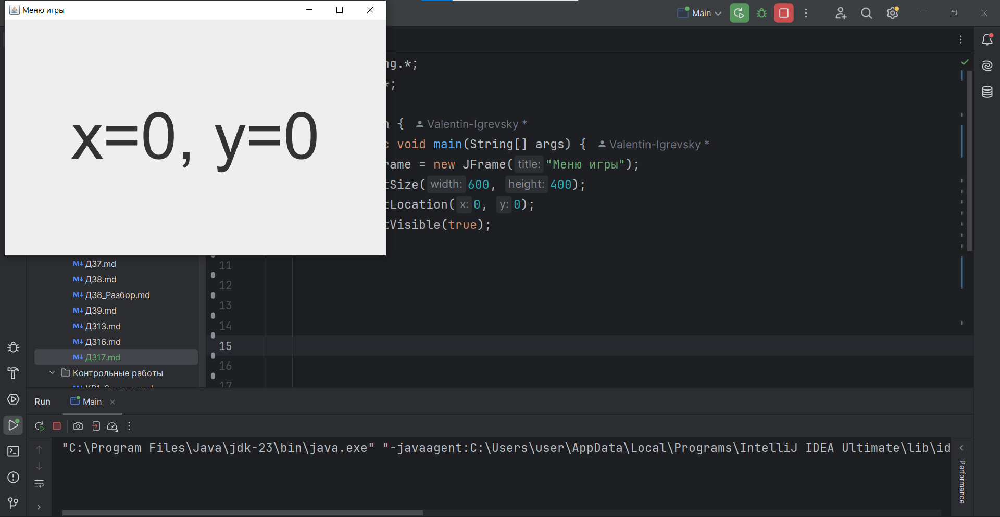
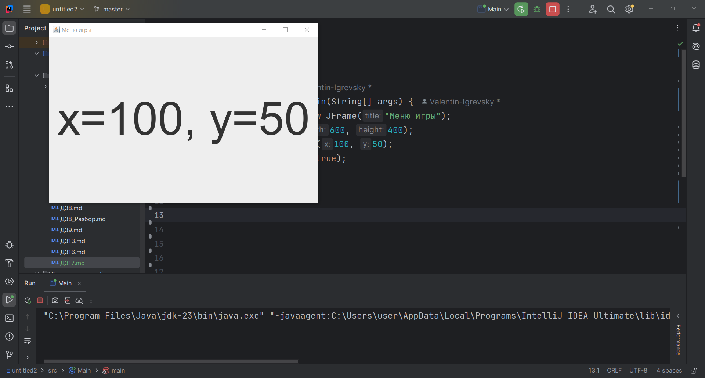
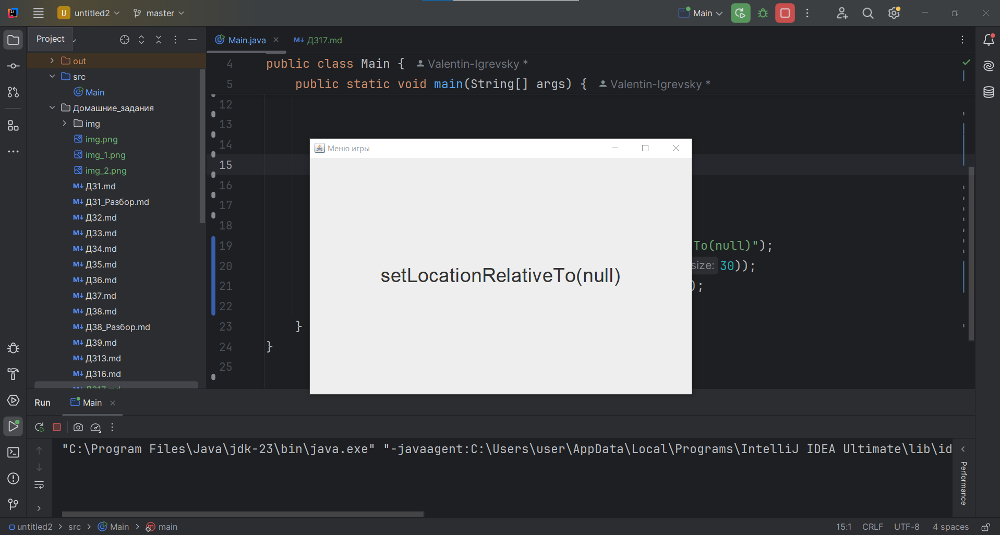
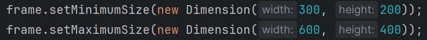
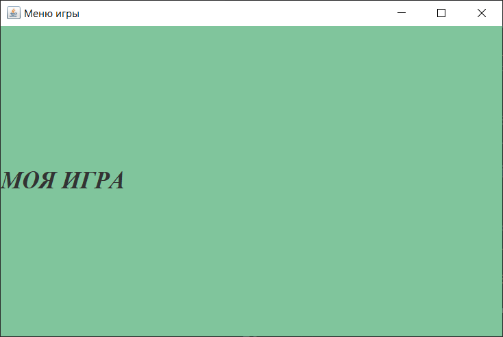
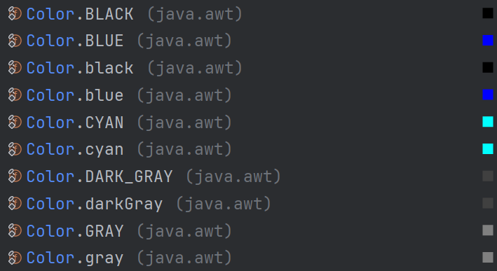
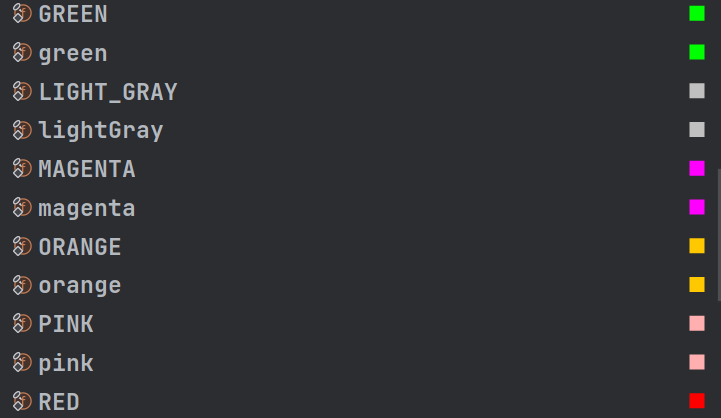
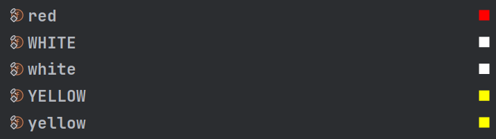
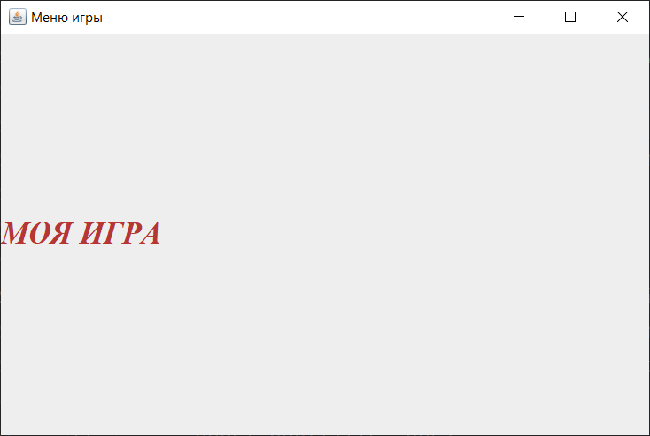

# ДЗ №17 (с 01.02.26 до 08.02.26)

---

---

### Введение

На занятии мы рассмотрели некоторые методы базовых элементов, с помощью которых можно устанавливать разные параметры (методы setter`ы). Этих методов настройки параметров много, вот небольшой список:

1) `JFrame` - основное окно
   - `.setSize(int, int)` - установить размер окна. Принимает 2 целочисленных числа `int` - ширину (`width`) и высоту (`height`)
   - `.setLocation(int, int)` - установить расположение окна на экране. Принимает 2 целочисленных числа `int` - расположение по горизонтали (`x`) и расположение по вертикали (`y`). Расположение начинается с **верхнего левого угла окна**. Например, если `x=0` и `y=0`, то верхний левый угол окна будет расположен в верхнем левом углу экрана компьютера. Если `x=100` и `y=50`, то верхний левый угол окна будет расположен на расстоянии в `100` пикселей по горизонтали и на расстоянии в `50` пикселей по вертикали от верхнего левого угла экрана.

    

    

   - `setLocationRelativeTo(Component)` - метод, который расположит окно в центре другого объекта (компонента). Если передать параметр `null` (т.е. буквально ничего), то окно расположится в центре экрана.

    

   - `.setMinimumSize(Dimension)` и `.setMaximumSize(Dimension)` - методы, который устанавливают минимальный и максимальный размеры окна. Принимают объект с типом `Dimension`, который в свою очередь принимает 2 целочисленный числа: `Dimension(600, 400)`
   
    

   - `.setResizable(boolean);` - метод, который принимает логический тип `boolean` и позволяет изменять размер окна (`true`) или нет (`false`).
   - `.setDefaultCloseOperation` - метод, который определяет, что произойдет после закрытия окна. Принимает одно из значений:
     - `JFrame.EXIT_ON_CLOSE` - завершить приложение
     - `JFrame.DISPOSE_ON_CLOSE` - закрыть только окно
     - `JFrame.HIDE_ON_CLOSE` - скрыть окно
     - `JFrame.DO_NOTHING_ON_CLOSE` - ничего не делать
   - `.setTitle(String)` - установить название окна. Принимает строку
   - `.setVisible(boolean)` - метод, который принимает логический тип `boolean` и делает окно видимым (`true`) или невидимым (`false`)
   - Также в `JFrame` автоматически вставлен объект, который помогает размещать другие объекты. У этого объекта можно изменить цвет, что изменит цвет окна: `.getContentPane().setBackground(Color)`. Про параметр `Color` - ниже
2) `JLabel` - текст
   - `.setText(String)` - метод изменяет текст. Принимает строку
   - `.setFont(Font)` - метод изменяет шрифт и размер текста. Принимает объект с типом `Font`. Объект `Font` при создании принимает 3 параметра:
     - Название шрифта. Например
       - `"Serif"`
       - `"Arial"`
       - `"Times New Roman"`
     - Оформление
       - `Font.PLAIN` - обычный текст
       - `Font.BOLD` - жирный текст
       - `Font.ITALIC` - курсив
       - Оформление можно комбинировать через оператор `|`: `Font.BOLD | Font.ITALIC`
     - Размер: целочисленное значение `int`
     - Пример: `.setFont(new Font("Times New Roman", Font.BOLD | Font.ITALIC, 28));`
     
     
   
   - `.setForeground(Color)` - изменение цвета текста. Принимает объект `Color`, который может быть выбрать из стандартного набора или создан на основе `RGB`-системы
     - Стандартный набор: 
     
     
     
         

     

     - `RGB`-система: `new Color(182, 54, 54)`
     
     
   
   - `.setHorizontalAlignment(...)` - горизонтальное выравнивание текста. Принимает 1 из 3 параметров:
     - `SwingConstants.LEFT` - по левой границе
     - `SwingConstants.CENTER` - по центру
     - `SwingConstants.RIGHT` - по правой границе
   - `.setVerticalAlignment(...)` - вертикальное выравнивание. Принимает 1 из 3 параметров:
     - `SwingConstants.TOP` - по верхней границе
     - `SwingConstants.CENTER` - по центру
     - `SwingConstants.BOTTOM` - по нижней границе
3) `JButton` - кнопка. У кнопки есть размеры, фон и текст, поэтому к ней применимы некоторые методы, который применимы к `JFrame` и к `JLabel`:
   - `.setFont(...)`
   - `.setForeground(...)`
   - `.setBackground(...)`
   - `.setMinimumSize(...)` и `.setMaximumSize(...)`
   - `.setHorizontalAlignment(...)` и `.setVerticalAlignment(...)`
   - `setText(...)`
   - Некоторые другие полезные методы:
   - `.setBorderPainted(boolean)` - включить границу кнопки (`true`) или отключить границу кнопки (`false`)
   - `.setEnabled(boolean)` - сделать кнопку активной (`true`) или неактивной (`false`)
   - `.setPreferredSize(Dimension)` - установить размер кнопки

---

Также мы начали проходить объекты для более гибкого размещения элементов. Их есть несколько типов, но для работы с ними необходим объект `JPanel` - панель (контейнер для компонентов)

Основные методы настройки JPanel:
- `.setLayout(LayoutManager)` - установить менеджер компоновки. Принимает из из нескольких типов компоновки объектов:
  - `FlowLayout` - компоненты располагаются в ряд
  - `GridLayout` - располжение по изначально заданной сетке (таблице)
  - `BorderLayout` - 5 зон (север, юг, запад, восток, центр) - базовый компоновщик, который встроен автоматически
  - `GridBagLayout` - гибкая сетка, с которой мы и будем работать
- `.setBackground(Color)` - установить цвет фона
- `.add(Component)` - добавить компонент

---

`GridBagConstraints` - это объект, который хранит параметры расположения для каждого компонента в `GridBagLayout`. Представьте его как "инструкцию" для каждого элемента: где стоять, как растягиваться, какие отступы иметь.

```java
GridBagConstraints gbc = new GridBagConstraints();
```

Разберем некоторые особенности `GridBagConstraints`:

- `gridx` и `gridy` - координаты ячейки, которые определяют, в какую ячейку сетки поместить компонент

```java
gbc.gridx = 0;  // первый столбец
gbc.gridy = 0;  // первая строка
```

- `gridwidth` и `gridheight` - сколько ячеек занимает компонент

```java
gbc.gridwidth = 2;   // занимает 2 столбца
gbc.gridheight = 1;  // занимает 1 строку
```

- `fill` - как заполнять ячейку. Определяет, растягивать ли компонент внутри ячейки:
  - `GridBagConstraints.NONE` - не растягивать (оставить оригинальный размер)
  - `GridBagConstraints.HORIZONTAL` - растянуть по горизонтали
  - `GridBagConstraints.VERTICAL` - растянуть по вертикали
  - `GridBagConstraints.BOTH` - растянуть по обеим осям

```java
gbc.fill = GridBagConstraints.HORIZONTAL;  // растянуть кнопку по ширине
```

- `insets` - внешние отступы (расстояние до элемента от границ или предущих элементов)

```java
gbc.insets = new Insets(10, 20, 30, 40);
// Верх=10, Лево=20, Низ=30, Право=40 (пиксели)
```

---

Ранее, когда мы добавляли новые объекты, мы добавляли их на окно (`JFrame`), но когда мы будем использовать `JPanel`, новые элементы будут добавляться к не к окну, а к панели, а саму панель уже добавляем к окну:

**Было:**

```java
JFrame frame = new JFrame("Меню игры");
JButton button = new JButton();
frame.add(button);
```

**Стало:**

```java
JFrame frame = new JFrame("Меню игры");
JPanel panel = new JPanel();
JButton button = new JButton();
panel.add(button);
frame.add(panel);
```

---

Настройка расположения новых объектов происходила при добавлении их в окно с помощью дополнительного параметра. Когда мы работаем с `JPanel` в качестве дополнительно параметра будет выступать ранее настроенный `GridBagConstraints`;

**Было:**

```java
JFrame frame = new JFrame("Меню игры");
JButton button = new JButton();
frame.add(button, BorderLayout.SOUTH);
```

**Стало:**

```java
JFrame frame = new JFrame("Меню игры");
JPanel panel = new JPanel(new GridBagLayout());
GridBagConstraints gbc = new GridBagConstraints();
gbc.gridx = 0;
gbc.gridy = 0;
gbc.gridwidth = 2;
gbc.gridheight = 1;
JButton button = new JButton();
panel.add(button, gbc);
frame.add(panel);
```

---

---

### Задание

В качестве практического задания - повторить код для меню, похожего на меню игры Minecraft, и поэкперементировать с:
- размерами окна и кнопок - попробуйте задать разные размеры
- цветами фона, текста, кнопок - попробуйте каждому элементу задать свой уникальный цвет
- шрифтами и размерами текста

**Код меню**

```java
import javax.swing.*;
import java.awt.*;

public class Main {
    public static void main(String[] args) {
        // Главное окно
        JFrame frame = new JFrame("Меню игры (не Minecraft)");
        frame.setDefaultCloseOperation(JFrame.EXIT_ON_CLOSE);
        frame.setSize(800, 600);
        frame.setResizable(false);
        frame.setLocationRelativeTo(null);

        // Настройка цвета фона
        Color backgroundColor = new Color(92, 156, 222);
        frame.getContentPane().setBackground(backgroundColor);

        // Панель с GridBagLayout
        JPanel panel = new JPanel(new GridBagLayout());
        panel.setBackground(backgroundColor);
        GridBagConstraints gbc = new GridBagConstraints();

        // ========== Заголовок ==========
        JLabel title = new JLabel("не MINECRAFT");
        title.setFont(new Font("Arial", Font.BOLD, 72));
        title.setForeground(Color.WHITE);
        title.setHorizontalAlignment(SwingConstants.CENTER);

        gbc.gridx = 0;
        gbc.gridy = 0;
        gbc.gridwidth = 4;
        gbc.insets = new Insets(20, 0, 60, 0);
        gbc.fill = GridBagConstraints.HORIZONTAL;
        panel.add(title, gbc);

        // ========== Основные кнопки ==========
        // Общие настройки для основных кнопок кнопок
        Font buttonFont = new Font("Arial", Font.BOLD, 24);
        Color buttonTextColor = Color.WHITE;
        Dimension buttonSize = new Dimension(300, 50);

        gbc.gridwidth = 4;
        gbc.fill = GridBagConstraints.HORIZONTAL;
        gbc.insets = new Insets(0, 50, 15, 50); // Отступы слева и справа

        // ========== Кнопка "Одиночная игра" ==========
        JButton singlePlayer = new JButton("Одиночная игра");
        singlePlayer.setFont(buttonFont);
        singlePlayer.setForeground(buttonTextColor);
        singlePlayer.setBackground(Color.BLACK);
        singlePlayer.setPreferredSize(buttonSize);
        singlePlayer.setMinimumSize(buttonSize);
        singlePlayer.setMaximumSize(buttonSize);

        gbc.gridx = 0;
        gbc.gridy = 1;
        panel.add(singlePlayer, gbc);

        // ========== Кнопка "Мультиплеер" ==========
        JButton multiplayer = new JButton("Мультиплеер");
        multiplayer.setFont(buttonFont);
        multiplayer.setForeground(buttonTextColor);
        multiplayer.setBackground(Color.BLACK);
        multiplayer.setPreferredSize(buttonSize);
        multiplayer.setMinimumSize(buttonSize);
        multiplayer.setMaximumSize(buttonSize);

        gbc.gridx = 0;
        gbc.gridy = 2;
        panel.add(multiplayer, gbc);

        // ========== Кнопка "Настройки" ==========
        JButton settings = new JButton("Настройки");
        settings.setFont(buttonFont);
        settings.setForeground(buttonTextColor);
        settings.setBackground(Color.BLACK);
        settings.setPreferredSize(buttonSize);
        settings.setMinimumSize(buttonSize);
        settings.setMaximumSize(buttonSize);

        gbc.gridx = 0;
        gbc.gridy = 3;
        panel.add(settings, gbc);

        // ========== Дополнительные кнопки ==========
        // Общие настройки для дополнительных кнопок
        Dimension otpButtonSize = new Dimension(150, 40);
        gbc.insets = new Insets(40, 10, 20, 10);
        gbc.gridwidth = 2;

        // Кнопка "Mods"
        JButton modsButton = new JButton("Mods");
        modsButton.setFont(buttonFont);
        modsButton.setForeground(buttonTextColor);
        modsButton.setBackground(Color.BLACK);
        modsButton.setPreferredSize(otpButtonSize);
        modsButton.setMinimumSize(otpButtonSize);
        modsButton.setMaximumSize(otpButtonSize);

        gbc.gridx = 0;
        gbc.gridy = 4;
        panel.add(modsButton, gbc);

        // Кнопка "Выход"
        JButton exitGame = new JButton("Выход");
        exitGame.setFont(buttonFont);
        exitGame.setForeground(new Color(255, 100, 100));
        exitGame.setBackground(Color.BLACK);
        exitGame.setPreferredSize(otpButtonSize);
        exitGame.setMinimumSize(otpButtonSize);
        exitGame.setMaximumSize(otpButtonSize);

        gbc.gridx = 2;
        gbc.gridy = 4;
        panel.add(exitGame, gbc);

        // ========== Панель и окно ==========
        frame.add(panel);
        frame.setVisible(true);
    }
}
```


