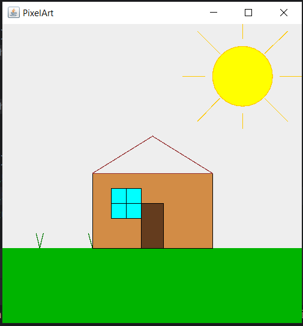
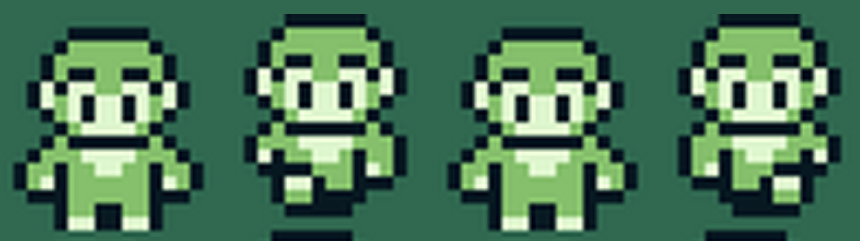
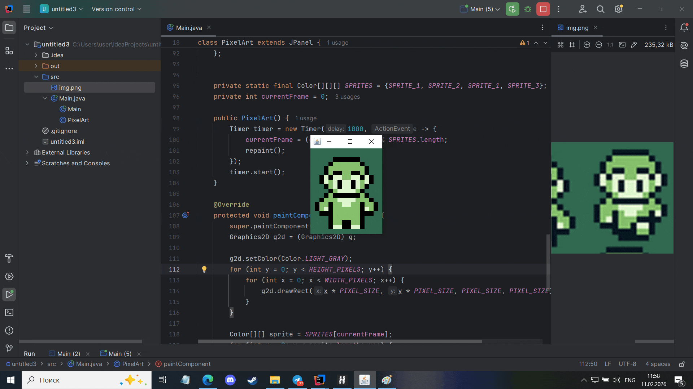

# ДЗ №18 (с 08.02.26 до 15.02.26)

---

---

### Введение

На занятии мы начали работать с графикой, для этого нам пришлось вспомнить, что такое наследование, а также узнали, для чего нужно выражение `@Override`. Домашнее задание будет более творческим, но будет место, где нужно будет подумать.

---

### Задание №1

Первым заданием будет поэксперементировать с "кистью" и что-нибудь нарисовать.

Вам дан код, который мы написали на занятии.

```java
import javax.swing.*;
import java.awt.*;

public class Main {
    public static void main(String[] args) {
        SwingUtilities.invokeLater(() -> {
            JFrame frame = new JFrame("PixelArt");
            frame.setDefaultCloseOperation(JFrame.EXIT_ON_CLOSE);

            frame.add(new PixelArt());
            frame.pack();
            frame.setLocationRelativeTo(null);
            frame.setVisible(true);
        });
    }
}

class PixelArt extends JPanel {
    private static final int WIDTH_PIXELS = 400;
    private static final int HEIGHT_PIXELS = 400;

    @Override
    protected void paintComponent(Graphics g) {
        super.paintComponent(g);
        Graphics2D g2d = (Graphics2D) g;
    }

    @Override
    public Dimension getPreferredSize() {
        return new Dimension(WIDTH_PIXELS, HEIGHT_PIXELS);
    }
}
```

Ваша задача в методе `paintComponent` использовать разные методы обеъкта `Graphics2D g2d` - "кисти" для рисования:

---

```java
drawLine(int x1, int y1, int x2, int y2);
```

Простая линия. `x1` и `y1` - координаты начальной точки, `x2` и `y2` - координаты второй точки. Между точками нарисуется прямая линия

---

```java
drawRect(int x, int y, int width, int height);
```
Контур прямоугольника. `x` и `y` - координаты верхнего левого угла прямоугольника. `width` - ширина и `height` - высота прямоуголиника (размеры указываются в пикселях)

---

```java
fillRect(int x, int y, int width, int height);
```

Закрашенный прямоугольник. Параметры такие же, как и у метода `drawRect`

---

```java
drawRoundRect(int x, int y, int width, int height, int arcWidth, int arcHeight);
```

Контур прямоугольника с закруглёнными углами. Параметры `x`, `y`, `width`, `height` аналогичны параметрам методов `drawRect` и `fillRect`. Параметр `arcWidth` отвечат за степень скругления на горизотнальных прямых, `arcHeight` - степень скругления на вертикальных прямых.

---

```java
fillRoundRect(int x, int y, int width, int height, int arcWidth, int arcHeight);
```

Закрашенный прямоугольник с закруглёнными углами. Параметры такие же, как и у метода `drawRoundRect`

---

```java
drawOval(int x, int y, int width, int height);
```

Контур эллипса (эллипс - овал). Параметры такие же, как и у метода `drawRect`

---

```java
fillOval(int x, int y, int width, int height);
```

Закрашенный эллипс. Параметры такие же, как и у метода `drawOval`

---

Не забываем, что для того чтобы изменить цвет, с помощью которого будет нарисован новый элемент, нужно изспользовать метод `setColor(Color c)`

--- 

##### Небольшой пример

```java
import javax.swing.*;
import java.awt.*;

public class Main {
    public static void main(String[] args) {
        SwingUtilities.invokeLater(() -> {
            JFrame frame = new JFrame("PixelArt");
            frame.setDefaultCloseOperation(JFrame.EXIT_ON_CLOSE);

            frame.add(new PixelArt());
            frame.pack();
            frame.setLocationRelativeTo(null);
            frame.setVisible(true);
        });
    }
}

class PixelArt extends JPanel {
    private static final int WIDTH_PIXELS = 400;
    private static final int HEIGHT_PIXELS = 400;

    @Override
    protected void paintComponent(Graphics g) {
        super.paintComponent(g);
        Graphics2D g2d = (Graphics2D) g;

        // Красный закрашеный прямоугольник
        g2d.setColor(Color.RED);
        g2d.fillRect(13, 13, 32, 32);

        // Черный контур прямоугольника
        g2d.setColor(Color.BLACK);
        g2d.drawRect(13, 13, 32, 32);

        // Оранжевая линия
        g2d.setColor(new Color(255, 144, 0));
        g2d.drawLine(14, 14, 44, 44);

        // Оранжевый закрашеный прямоугольник с закруглёнными углами
        g2d.setColor(Color.ORANGE);
        g2d.fillRoundRect(50, 13, 50, 70, 10, 20);

        // Синий прямоугольник с закруглёнными углами
        g2d.setColor(new Color(0, 55, 255));
        g2d.drawRoundRect(50, 13, 50, 70, 10, 20);

        // Розовый закрашенный эллипс (овал)
        g2d.setColor(Color.PINK);
        g2d.fillOval(50, 90, 40, 20);

        // Салатовый контур эллипса (овала)
        g2d.setColor(new Color(70, 255, 0));
        g2d.drawOval(50, 90, 40, 20);
    }

    @Override
    public Dimension getPreferredSize() {
        return new Dimension(WIDTH_PIXELS, HEIGHT_PIXELS);
    }
}
```

Попробуйте что-нибудь нарисовать. Например что-то такое:



---

---

### Задание №2

Второе задание тоже креативное и используется код, который мы писали на занятии.

Вам дам частично готовый код, вам нужно найти какую-нибудь пиксельную картинку в интернете, и "перерисовать" ее в программу с помощью кода. Желательно, чтобы у картинки было более 2 спрайтов (один спрайт - один кадр анимации)

```java
import javax.swing.*;
import java.awt.*;

public class Main {
    public static void main(String[] args) {
        SwingUtilities.invokeLater(() -> {
            JFrame frame = new JFrame("PixelArt");
            frame.setDefaultCloseOperation(JFrame.EXIT_ON_CLOSE);

            frame.add(new PixelArt());
            frame.pack();
            frame.setLocationRelativeTo(null);
            frame.setVisible(true);
        });
    }
}

class PixelArt extends JPanel {
    private static final int PIXEL_SIZE = 10;
    private static final int WIDTH_PIXELS = 20;
    private static final int HEIGHT_PIXELS = 20;

    // Тут палитра цветов

    // Спрайты

    private static final Color[][][] SPRITES = {/* Добавляем спрайты в массив */};
    private int currentFrame = 0;

    public PixelArt() {
        Timer timer = new Timer(200, e -> {
            currentFrame = (currentFrame + 1) % SPRITES.length;
            repaint();
        });
        timer.start();
    }

    @Override
    protected void paintComponent(Graphics g) {
        super.paintComponent(g);
        Graphics2D g2d = (Graphics2D) g;

        g2d.setColor(Color.LIGHT_GRAY);
        for (int y = 0; y < HEIGHT_PIXELS; y++) {
            for (int x = 0; x < WIDTH_PIXELS; x++) {
                g2d.drawRect(x * PIXEL_SIZE, y * PIXEL_SIZE, PIXEL_SIZE, PIXEL_SIZE);
            }
        }

        Color[][] sprite = SPRITES[currentFrame];
        for (int y = 0; y < sprite.length; y++) {
            for (int x = 0; x < sprite[y].length; x++) {
                if (sprite[y][x] != null) {
                    g2d.setColor(sprite[y][x]);
                    g2d.fillRect(x * PIXEL_SIZE, y * PIXEL_SIZE, PIXEL_SIZE, PIXEL_SIZE);
                }
            }
        }

    }

    @Override
    public Dimension getPreferredSize() {
        return new Dimension(
                WIDTH_PIXELS * PIXEL_SIZE,
                HEIGHT_PIXELS * PIXEL_SIZE
        );
    }
}
```

---

**Вам нужно:** 

1) Посчитать размеры вашей картинки в пикселях и занести в нужные поля, например:

```java
    private static final int WIDTH_PIXELS = 20;
    private static final int HEIGHT_PIXELS = 20;
```

2) Решить какого размера будет каждый пиксель вашей картинки, например:

```java
private static final int PIXEL_SIZE = 10;
```

3) Подобрать нужную вам палитру цветов, например:

```java
    private static final Color T = null;
    private static final Color O = Color.ORANGE;
    private static final Color B = Color.BLACK;
    private static final Color Y = Color.YELLOW;
    private static final Color W = Color.WHITE;
    private static final Color R = Color.RED;
```

4) Нарисовать спрайты с помощью двумерных массивов и использования заготовленных цветов, например:

```java
    private static final Color[][] SPRITE_1 = {
            {T, T, T, T, T, T, T, T, T, T, T, T, T, T, T, T, T, T, T, T},
            {T, T, T, T, T, T, T, T, B, B, B, B, T, T, T, T, T, T, T, T},
            {T, T, T, T, T, T, B, B, O, O, O, O, B, B, T, T, T, T, T, T},
            {T, T, T, T, B, B, O, O, Y, Y, Y, Y, O, O, B, B, T, T, T, T},
            {T, T, T, B, O, O, Y, Y, Y, Y, Y, Y, Y, Y, O, O, B, T, T, T},
            {T, T, T, B, O, Y, Y, Y, Y, Y, Y, Y, Y, Y, Y, O, B, T, T, T},
            {T, T, B, O, Y, Y, Y, Y, Y, Y, Y, Y, Y, Y, Y, Y, O, B, T, T},
            {T, T, B, O, Y, Y, B, B, Y, Y, Y, Y, B, B, Y, Y, O, B, T, T},
            {T, B, O, Y, Y, B, Y, Y, B, Y, Y, B, Y, Y, B, Y, Y, O, B, T},
            {T, B, O, Y, Y, Y, Y, Y, Y, Y, Y, Y, Y, Y, Y, Y, Y, O, B, T},
            {T, B, O, Y, Y, Y, Y, Y, Y, Y, Y, Y, Y, Y, Y, Y, Y, O, B, T},
            {T, B, O, Y, Y, Y, Y, Y, Y, Y, Y, Y, Y, Y, Y, Y, Y, O, B, T},
            {T, T, B, O, Y, Y, B, Y, Y, Y, Y, Y, Y, B, Y, Y, O, B, T, T},
            {T, T, B, O, Y, Y, B, Y, Y, Y, Y, Y, Y, B, Y, Y, O, B, T, T},
            {T, T, T, B, O, Y, Y, B, Y, Y, Y, Y, B, Y, Y, O, B, T, T, T},
            {T, T, T, B, O, O, Y, Y, B, B, B, B, Y, Y, O, O, B, T, T, T},
            {T, T, T, T, B, B, O, O, Y, Y, Y, Y, O, O, B, B, T, T, T, T},
            {T, T, T, T, T, T, B, B, O, O, O, O, B, B, T, T, T, T, T, T},
            {T, T, T, T, T, T, T, T, B, B, B, B, T, T, T, T, T, T, T, T},
            {T, T, T, T, T, T, T, T, T, T, T, T, T, T, T, T, T, T, T, T}
    };

    private static final Color[][] SPRITE_2 = {
            {T, T, T, T, T, T, T, T, T, T, T, T, T, T, T, T, T, T, T, T},
            {T, T, T, T, T, T, T, T, B, B, B, B, T, T, T, T, T, T, T, T},
            {T, T, T, T, T, T, B, B, O, O, O, O, B, B, T, T, T, T, T, T},
            {T, T, T, T, B, B, O, O, Y, Y, Y, Y, O, O, B, B, T, T, T, T},
            {T, T, T, B, O, O, Y, Y, Y, Y, Y, Y, Y, Y, O, O, B, T, T, T},
            {T, T, T, B, O, Y, Y, Y, Y, Y, Y, Y, Y, Y, Y, O, B, T, T, T},
            {T, T, B, O, Y, Y, Y, Y, Y, Y, Y, Y, Y, Y, Y, Y, O, B, T, T},
            {T, T, B, O, Y, Y, W, B, Y, Y, Y, Y, W, B, Y, Y, O, B, T, T},
            {T, B, O, Y, Y, Y, W, W, Y, Y, Y, Y, W, W, Y, Y, Y, O, B, T},
            {T, B, O, Y, Y, Y, Y, Y, Y, Y, Y, Y, Y, Y, Y, Y, Y, O, B, T},
            {T, B, O, Y, Y, Y, Y, Y, Y, Y, Y, Y, Y, Y, Y, Y, Y, O, B, T},
            {T, B, O, Y, Y, Y, Y, Y, Y, Y, Y, Y, Y, Y, Y, Y, Y, O, B, T},
            {T, T, B, O, Y, Y, B, B, B, B, B, B, B, B, Y, Y, O, B, T, T},
            {T, T, B, O, Y, Y, B, R, R, R, R, R, R, B, Y, Y, O, B, T, T},
            {T, T, T, B, O, Y, Y, B, R, R, R, R, B, Y, Y, O, B, T, T, T},
            {T, T, T, B, O, O, Y, Y, B, B, B, B, Y, Y, O, O, B, T, T, T},
            {T, T, T, T, B, B, O, O, Y, Y, Y, Y, O, O, B, B, T, T, T, T},
            {T, T, T, T, T, T, B, B, O, O, O, O, B, B, T, T, T, T, T, T},
            {T, T, T, T, T, T, T, T, B, B, B, B, T, T, T, T, T, T, T, T},
            {T, T, T, T, T, T, T, T, T, T, T, T, T, T, T, T, T, T, T, T}
    };
```

5) Добавить спрайты в массив, чтобы сработала анимация:

```java
private static final Color[][][] SPRITES = {SPRITE_1, SPRITE_2};
```

---

В качестве примера, я взял вот такую катринку с этого [**сайта**](https://itch.io/game-assets/free/tag-2d/tag-pixel-art/tag-sprites?ysclid=mlhr2o5yya542457105) (<- сюда можно нажать для перехода на сайт): 



---

1) Посчитал размеры - 16 пикселей в ширину, 19 в высоту
2) Решил, что рамер одного пикселя будет 10
3) Подобрал нужные цвета
4) Здесь 4 спрайта, при этом 1 и 3 одинаковые, поэтому можно перенести только 3 - 1, 2 и 4. Так и сделал
5) Добавил спрайты в массив в нужной последовательности

**Получившийся код:**

```java
import javax.swing.*;
import java.awt.*;

public class Main {
    public static void main(String[] args) {
        SwingUtilities.invokeLater(() -> {
            JFrame frame = new JFrame("PixelArt");
            frame.setDefaultCloseOperation(JFrame.EXIT_ON_CLOSE);

            frame.add(new PixelArt());
            frame.pack();
            frame.setLocationRelativeTo(null);
            frame.setVisible(true);
        });
    }
}

class PixelArt extends JPanel {
    private static final int PIXEL_SIZE = 10;
    private static final int WIDTH_PIXELS = 16;
    private static final int HEIGHT_PIXELS = 19;

    private static final Color G = new Color(48, 104, 80);
    private static final Color B = Color.BLACK;
    private static final Color W = new Color(222, 246, 205);
    private static final Color S = new Color(134, 192, 108);

    private static final Color[][] SPRITE_1 = {
            {G,G,G,G,G,G,G,G,G,G,G,G,G,G,G,G},
            {G,G,G,G,G,G,G,G,G,G,G,G,G,G,G,G},
            {G,G,G,G,G,B,B,B,B,B,B,G,G,G,G,G},
            {G,G,G,G,B,S,S,S,S,S,S,B,G,G,G,G},
            {G,G,G,B,S,S,S,S,S,S,S,S,B,G,G,G},
            {G,G,G,B,S,B,B,S,S,B,B,S,B,G,G,G},
            {G,G,B,W,B,W,W,S,S,W,W,B,W,B,G,G},
            {G,G,B,W,S,W,B,W,W,B,W,S,W,B,G,G},
            {G,G,G,B,S,W,B,W,W,B,W,S,B,G,G,G},
            {G,G,G,G,B,S,W,W,W,W,S,B,G,G,G,G},
            {G,G,G,B,S,B,B,B,B,B,B,S,B,G,G,G},
            {G,G,B,S,S,S,W,W,W,W,S,S,S,B,G,G},
            {G,B,S,S,B,S,S,W,W,S,S,B,S,S,B,G},
            {G,B,S,W,B,S,S,S,S,S,S,B,W,S,B,G},
            {G,G,B,B,B,S,S,S,S,S,S,B,B,B,G,G},
            {G,G,G,G,B,S,S,S,S,S,S,B,G,G,G,G},
            {G,G,G,G,B,S,S,B,B,S,S,B,G,G,G,G},
            {G,G,G,G,B,W,W,B,B,W,W,B,G,G,G,G},
            {G,G,G,G,G,G,G,G,G,G,G,G,G,G,G,G},
    };

    private static final Color[][] SPRITE_2 = {
            {G,G,G,G,G,G,G,G,G,G,G,G,G,G,G,G},
            {G,G,G,G,G,B,B,B,B,B,B,G,G,G,G,G},
            {G,G,G,G,B,S,S,S,S,S,S,B,G,G,G,G},
            {G,G,G,B,S,S,S,S,S,S,S,S,B,G,G,G},
            {G,G,G,B,S,B,B,S,S,B,B,S,B,G,G,G},
            {G,G,B,W,B,W,W,S,S,W,W,B,W,B,G,G},
            {G,G,B,W,S,W,B,W,W,B,W,S,W,B,G,G},
            {G,G,G,B,S,W,B,W,W,B,W,S,B,G,G,G},
            {G,G,G,G,B,S,W,W,W,W,S,B,G,G,G,G},
            {G,G,G,B,S,B,B,B,B,B,B,S,B,G,G,G},
            {G,G,B,S,S,S,W,W,W,W,S,S,S,B,G,G},
            {G,G,B,W,B,S,S,W,W,S,B,S,S,B,G,G},
            {G,G,G,B,B,B,B,S,S,S,B,W,S,B,G,G},
            {G,G,G,G,B,W,W,B,W,W,B,B,B,G,G,G},
            {G,G,G,G,B,S,S,B,B,B,B,G,G,G,G,G},
            {G,G,G,G,G,B,B,B,B,B,G,G,G,G,G,G},
            {G,G,G,G,G,G,G,G,G,G,G,G,G,G,G,G},
            {G,G,G,G,G,G,G,G,G,G,G,G,G,G,G,G},
            {G,G,G,G,G,G,G,G,G,G,G,G,G,G,G,G},
    };

    private static final Color[][] SPRITE_3 = {
            {G,G,G,G,G,G,G,G,G,G,G,G,G,G,G,G},
            {G,G,G,G,G,B,B,B,B,B,B,G,G,G,G,G},
            {G,G,G,G,B,S,S,S,S,S,S,B,G,G,G,G},
            {G,G,G,B,S,S,S,S,S,S,S,S,B,G,G,G},
            {G,G,G,B,S,B,B,S,S,B,B,S,B,G,G,G},
            {G,G,B,W,B,W,W,S,S,W,W,B,W,B,G,G},
            {G,G,B,W,S,W,B,W,W,B,W,S,W,B,G,G},
            {G,G,G,B,S,W,B,W,W,B,W,S,B,G,G,G},
            {G,G,G,G,B,S,W,W,W,W,S,B,G,G,G,G},
            {G,G,G,B,S,B,B,B,B,B,B,S,B,G,G,G},
            {G,G,B,S,S,S,W,W,W,W,S,S,S,B,G,G},
            {G,G,B,S,S,B,S,W,W,S,S,B,W,B,G,G},
            {G,G,G,B,S,W,B,S,S,S,B,B,B,G,G,G},
            {G,G,G,G,B,B,B,W,W,B,W,W,B,G,G,G},
            {G,G,G,G,G,B,B,B,B,B,S,S,B,G,G,G},
            {G,G,G,G,G,G,B,B,B,B,B,B,G,G,G,G},
            {G,G,G,G,G,G,G,G,G,G,G,G,G,G,G,G},
            {G,G,G,G,G,G,G,G,G,G,G,G,G,G,G,G},
            {G,G,G,G,G,G,G,G,G,G,G,G,G,G,G,G},
    };


    private static final Color[][][] SPRITES = {SPRITE_1, SPRITE_2, SPRITE_1, SPRITE_3};
    private int currentFrame = 0;

    public PixelArt() {
        Timer timer = new Timer(200, e -> {
            currentFrame = (currentFrame + 1) % SPRITES.length;
            repaint();
        });
        timer.start();
    }

    @Override
    protected void paintComponent(Graphics g) {
        super.paintComponent(g);
        Graphics2D g2d = (Graphics2D) g;

        g2d.setColor(Color.LIGHT_GRAY);
        for (int y = 0; y < HEIGHT_PIXELS; y++) {
            for (int x = 0; x < WIDTH_PIXELS; x++) {
                g2d.drawRect(x * PIXEL_SIZE, y * PIXEL_SIZE, PIXEL_SIZE, PIXEL_SIZE);
            }
        }

        Color[][] sprite = SPRITES[currentFrame];
        for (int y = 0; y < sprite.length; y++) {
            for (int x = 0; x < sprite[y].length; x++) {
                if (sprite[y][x] != null) {
                    g2d.setColor(sprite[y][x]);
                    g2d.fillRect(x * PIXEL_SIZE, y * PIXEL_SIZE, PIXEL_SIZE, PIXEL_SIZE);
                }
            }
        }

    }

    @Override
    public Dimension getPreferredSize() {
        return new Dimension(
                WIDTH_PIXELS * PIXEL_SIZE,
                HEIGHT_PIXELS * PIXEL_SIZE
        );
    }
}
```

---

**Получилась простенькая анимация:**



Можете скопировать и протестировать самостоятельно :)
