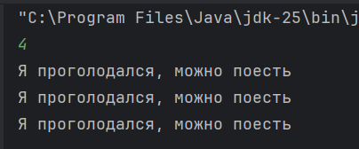
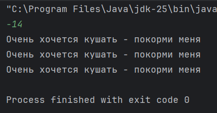
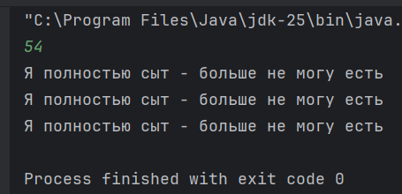

# ДЗ №2 (с 28.09.25 до 05.10.25)

---

---

### Задание №1

Сделать [**домашнее задание №1**](ДЗ1.md). Прикрепляю [**разбор задания**](ДЗ1_Разбор.md), чтобы было проще, но лучше обратиться туда для итоговой самопроверки, или если возникнут трудности.

---

---

### Задание №2

##### Ситуация:

Представим, что у нас есть _виртуальный питомец_, у которого есть от 0 до 7 единиц сытости (как голод в _Minecraft_), и мы можем обратиться к нему и узнать сыт он или голоден.

В зависисомти от того, сколько у него единиц сытости, он дает нам разный ответ:

- `7 единиц` - "Я полностью сыт - больше не могу есть"
- `6` - "Сейчас я сыт"
- `5` - "Пока что я не голоден, но скоро можно будет перекусить"
- `4` - "Я проголодался, можно поесть"
- `3`, `2`, `1` и `0` - "Очень хочется кушать - покорми меня"

---

##### Готовая часть программы:

У нас есть часть программы, которая:

- Инициализует переменную типа `Scaner`, чтобы удобно считывать значения из консоли
- Запрашивает ввод в консоль число, показывающее сколько сейчас единиц сытости у нашего питомца
- Сводит введенное значение к значению от 0 до 7, т.е. если ввели меньше 0 - будет 0, если больше 7 - будет 7
- Используеться конструкция `if - else if - else`, чтобы определить, что должен ответить питомец

```Java
import java.util.Scanner;

public class Main {
    public static void main(String[] args) {
        Scanner scanner = new Scanner(System.in);
        int food = scanner.nextInt();

        food = food > 7 ? 7 : (food < 0 ? 0 : food);

        if (food == 7) {
            System.out.println("Я полностью сыт - больше не могу есть");
        } else if (food == 6) {
            System.out.println("Сейчас я сыт");
        } else if (food == 5) {
            System.out.println("Пока что я не голоден, но скоро можно будет перекусить");
        } else if (food == 4) {
            System.out.println("Я проголодался, можно поесть");
        } else {
            System.out.println("Очень хочется кушать - покорми меня");
        }
    }
}
```

---

##### Что нужно сделать:

Нужно дописать программу, дописав в нее две конструкции `switch - case`:

- Первая должна использовать оператор `break`
- Вторая быть упрощенного вида, без `break`, с ипользованием `->`

---

##### Как это должно выглядеть:

```Java
import java.util.Scanner;

public class Main {
    public static void main(String[] args) {
        Scanner scanner = new Scanner(System.in);
        int food = scanner.nextInt();

        food = food > 7 ? 7 : (food < 0 ? 0 : food);

        if (food == 7) {
            System.out.println("Я полностью сыт - больше не могу есть");
        } else if (food == 6) {
            System.out.println("Сейчас я сыт");
        } else if (food == 5) {
            System.out.println("Пока что я не голоден, но скоро можно будет перекусить");
        } else if (food == 4) {
            System.out.println("Я проголодался, можно поесть");
        } else {
            System.out.println("Очень хочется кушать - покорми меня");
        }

        switch (food) {
            case 7:
                System.out.println("Я полностью сыт - больше не могу есть");
                break;

                // Еще несколько case`ов
                
            default:
                System.out.println("Очень хочется кушать - покорми меня");
        }


        switch (food) {
            case 7 -> System.out.println("Я полностью сыт - больше не могу есть");

            // Еще несколько case`ов

            // Сообщение, которое выводится если не выполнились другие случаи
        }
    }
}
```

---

##### Что нужно вспомнить, чтобы выполнить задание:

- Конструкцию `if - else if - else`
- Как соотносятся конструкции `if - else if - else` и `switch - case`:
  - Что такое `switch`
  - Что такое `case`
  - Что такое `default`
- Что делает оператор `break`
- Почему в первом `switch - case` нужен `break`, а во втором нет

---

##### Что должно получиться:

После запуска написанной программы, в консоль нужно ввести любое число. Попробуйте сделать это несколько раз:
- Введите число от 0 до 7
- Введите число меньше 0
- Введите число больше 7

При каждом запусте послее ввода числа, в консоль должно вывестить три одинаковых сообщения







---

##### Что нужно, чтобы ДЗ было зачтено:

- **1 вариант**: Принести ноутбук с программой и продемонстрировать ее корректную работу
- **2 вариант**: Принести фотографии:
  - получившейся программы
  - результатов выполнения программы
- **3 вариант**: Попросить родителей прислать преподавателю фотографии:
    - получившейся программы
    - результатов выполнения программы

---

---

### Задание №3 (Не обязательное / со звездочкой / на внимательность)

В готовой части программы есть строчка:

```Java
food = food > 7 ? 7 : (food < 0 ? 0 : food);
```

Подумайте для чего она нужна
