# ДЗ №20 (с 22.02.26 до 01.03.26)

---

---

### Введение

Мы продолжаем писать платформер и на последнем занятии по мимо игрока добавили основной экран и платформы, по которым игрок может передвигаться. Также мы написали необходимый код для считывания нажатий клавиш и связали его с движением игрока. Далее нам предстоит начать работать с файловой системой для подгрузки изображений - для этого мы научились создавать и настраивать каталог (папка/дериктория) для хранения файлов, который будут использоваться в проекте.

---

Все задания домашней работы необходимо выполнять в проекте, который использовался для предыдущих двух заданий.

---

---

### Задание №1

Первым делом необходимо дописать код, а точнее класс `Game`, который отвечает за считывание нажатий клавиш, создание платформ и игрока, а также управление игроком:

```java
class Game extends JPanel implements KeyListener, ActionListener {
    private Player player;

    private boolean leftPressed = false;
    private boolean rightPressed = false;

    private final ArrayList<Rectangle> platforms = new ArrayList<>();

    public Game() {
        setPreferredSize(new Dimension(800, 600));
        setBackground(new Color(225, 149, 48));
        setFocusable(true);
        addKeyListener(this);
        player = new Player(100, 400);

        platforms.add(new Rectangle(0, 500, 2000, 100));
        platforms.add(new Rectangle(300, 420, 120, 20));
        platforms.add(new Rectangle(500, 350, 120, 20));
        platforms.add(new Rectangle(750, 300, 120, 20));

        Timer timer = new Timer(16, this);
        timer.start();
    }

    @Override
    public void actionPerformed(ActionEvent e) {
        update();
        repaint();
    }

    private void update() {
        player.applyGravity();

        if (leftPressed) player.moveLeft();
        if (rightPressed) player.moveRight();
        if (!leftPressed && !rightPressed) player.stop();

        player.update();

        for (Rectangle platform : platforms) {
            player.checkCollision(platform);
        }
    }

    @Override
    protected void paintComponent(Graphics g) {
        super.paintComponent(g);
        Graphics2D g2d = (Graphics2D) g;

        g2d.setColor(new Color(0, 0, 0));
        for (Rectangle platform : platforms) {
            g2d.fill(platform);
        }

        player.draw(g2d);
    }

    @Override
    public void keyPressed(KeyEvent e) {
        int keyCode = e.getKeyCode();

        if (keyCode == KeyEvent.VK_A) leftPressed = true;
        if (keyCode == KeyEvent.VK_D) rightPressed = true;
        if (keyCode == KeyEvent.VK_SPACE) player.jump();
    }

    @Override
    public void keyReleased(KeyEvent e) {
        int keyCode = e.getKeyCode();

        if (keyCode == KeyEvent.VK_A) leftPressed = false;
        if (keyCode == KeyEvent.VK_D) rightPressed = false;
    }

    @Override
    public void keyTyped(KeyEvent e) {}
}
```

---

**Важные мометны в коде:**

1) `KeyListener`:

Рисовать мы уже научились с помощью наследования класса `JPanel`, однако чтобы класс `Game` мог отвечать за обработку нажатий клавищ нам необходимо реализовать обязательные методы интерфейса `KeyListener`:

- `public void keyPressed(KeyEvent e)` - метод, определяющий, что клавишу нажали
- `public void keyReleased(KeyEvent e)` - метод, определяющий, что клавишу отжали
- `public void keyTyped(KeyEvent e)` - метод для определения нажания клавишь при печати (когда набираешь что-то на клавиатуре)

2) `ActionListener`:

Также нам необходим какой-то механизм, который запускал бы обработку всех изменений в игре. Для этого мы реализуем обязательный метод `public void actionPerformed(ActionEvent e)` интерфейса `ActionListener`. Именно этот метод будет автоматически вызываться каждые 16мс брагодаря таймеру `Timer`

3) `ArrayList`:

Т.к. класс `Game` содержит в себе платформы нам нужно где-то хранить информацию о всех платформах. Ранее мы бы использовали обычный массив, однако это неудобно, поэтому мы начинаем использовать вспомогательный класс `ArrayList`. `ArrayList` - это такой же массив, но у которого есть много удобных методов, который позволяют работать с элементами массива, например добавлять новые или удалять ненужные.

Для добавления новых элементов используется метод `.add(элемент)`

4) "Новый" цикл `for`:

Ранее, чтобы перебирать элементы массивов мы использовать цикл `for`, который выглядел приблизительно так:

```java
for (int i = 0; i < 10; i++) {}
```

Однако вводя массив `ArrayList`, мы может перебрать все элементы данного массива упрощенной версией:

```java
for (Rectangle platform : platforms) {}
```

5) Самое важное:

Чтобы мы могли использовать все нововведения необходимо подключить (импортировать) все необходимые классы и интерфейсы:

```java
import java.awt.event.ActionEvent;
import java.awt.event.ActionListener;
import java.awt.event.KeyEvent;
import java.awt.event.KeyListener;
import java.util.ArrayList;
```

---

**Итоговый код**:

```java
import javax.swing.*;
import java.awt.*;
import java.awt.event.ActionEvent;
import java.awt.event.ActionListener;
import java.awt.event.KeyEvent;
import java.awt.event.KeyListener;
import java.util.ArrayList;

public class Main {
    public static void main(String[] args) {
        SwingUtilities.invokeLater(() -> {
            JFrame frame = new JFrame("PixelArt");
            frame.setDefaultCloseOperation(JFrame.EXIT_ON_CLOSE);

            frame.add(new Game());
            frame.pack();
            frame.setLocationRelativeTo(null);
            frame.setVisible(true);
        });
    }
}

class Player {
    private double x;
    private double y;

    private double velX;
    private double velY;

    private final double jumpStrength = -12;
    private final double speedStrength = 4;

    private final double gravity = 0.5;

    private boolean onGround = true;

    private static final int WIDTH_PIXELS = 16;
    private static final int HEIGHT_PIXELS = 19;
    private static final int PIXEL_SIZE = 4;

    private static final Color G = null;
    private static final Color B = Color.BLACK;
    private static final Color W = new Color(222, 246, 205);
    private static final Color S = new Color(134, 192, 108);

    private static final Color[][] SPRITE_1 = {
            {G,G,G,G,G,G,G,G,G,G,G,G,G,G,G,G},
            {G,G,G,G,G,G,G,G,G,G,G,G,G,G,G,G},
            {G,G,G,G,G,B,B,B,B,B,B,G,G,G,G,G},
            {G,G,G,G,B,S,S,S,S,S,S,B,G,G,G,G},
            {G,G,G,B,S,S,S,S,S,S,S,S,B,G,G,G},
            {G,G,G,B,S,B,B,S,S,B,B,S,B,G,G,G},
            {G,G,B,W,B,W,W,S,S,W,W,B,W,B,G,G},
            {G,G,B,W,S,W,B,W,W,B,W,S,W,B,G,G},
            {G,G,G,B,S,W,B,W,W,B,W,S,B,G,G,G},
            {G,G,G,G,B,S,W,W,W,W,S,B,G,G,G,G},
            {G,G,G,B,S,B,B,B,B,B,B,S,B,G,G,G},
            {G,G,B,S,S,S,W,W,W,W,S,S,S,B,G,G},
            {G,B,S,S,B,S,S,W,W,S,S,B,S,S,B,G},
            {G,B,S,W,B,S,S,S,S,S,S,B,W,S,B,G},
            {G,G,B,B,B,S,S,S,S,S,S,B,B,B,G,G},
            {G,G,G,G,B,S,S,S,S,S,S,B,G,G,G,G},
            {G,G,G,G,B,S,S,B,B,S,S,B,G,G,G,G},
            {G,G,G,G,B,W,W,B,B,W,W,B,G,G,G,G},
            {G,G,G,G,G,G,G,G,G,G,G,G,G, G,G,G},
    };

    private static final Color[][] SPRITE_2 = {
            {G,G,G,G,G,G,G,G,G,G,G,G,G,G,G,G},
            {G,G,G,G,G,B,B,B,B,B,B,G,G,G,G,G},
            {G,G,G,G,B,S,S,S,S,S,S,B,G,G,G,G},
            {G,G,G,B,S,S,S,S,S,S,S,S,B,G,G,G},
            {G,G,G,B,S,B,B,S,S,B,B,S,B,G,G,G},
            {G,G,B,W,B,W,W,S,S,W,W,B,W,B,G,G},
            {G,G,B,W,S,W,B,W,W,B,W,S,W,B,G,G},
            {G,G,G,B,S,W,B,W,W,B,W,S,B,G,G,G},
            {G,G,G,G,B,S,W,W,W,W,S,B,G,G,G,G},
            {G,G,G,B,S,B,B,B,B,B,B,S,B,G,G,G},
            {G,G,B,S,S,S,W,W,W,W,S,S,S,B,G,G},
            {G,G,B,W,B,S,S,W,W,S,B,S,S,B,G,G},
            {G,G,G,B,B,B,B,S,S,S,B,W,S,B,G,G},
            {G,G,G,G,B,W,W,B,W,W,B,B,B,G,G,G},
            {G,G,G,G,B,S,S,B,B,B,B,G,G,G,G,G},
            {G,G,G,G,G,B,B,B,B,B,G,G,G,G,G,G},
            {G,G,G,G,G,G,G,G,G,G,G,G,G,G,G,G},
            {G,G,G,G,G,G,G,G,G,G,G,G,G,G,G,G},
            {G,G,G,G,G,G,G,G,G,G,G,G,G,G,G,G},
    };

    private static final Color[][] SPRITE_3 = {
            {G,G,G,G,G,G,G,G,G,G,G,G,G,G,G,G},
            {G,G,G,G,G,B,B,B,B,B,B,G,G,G,G,G},
            {G,G,G,G,B,S,S,S,S,S,S,B,G,G,G,G},
            {G,G,G,B,S,S,S,S,S,S,S,S,B,G,G,G},
            {G,G,G,B,S,B,B,S,S,B,B,S,B,G,G,G},
            {G,G,B,W,B,W,W,S,S,W,W,B,W,B,G,G},
            {G,G,B,W,S,W,B,W,W,B,W,S,W,B,G,G},
            {G,G,G,B,S,W,B,W,W,B,W,S,B,G,G,G},
            {G,G,G,G,B,S,W,W,W,W,S,B,G,G,G,G},
            {G,G,G,B,S,B,B,B,B,B,B,S,B,G,G,G},
            {G,G,B,S,S,S,W,W,W,W,S,S,S,B,G,G},
            {G,G,B,S,S,B,S,W,W,S,S,B,W,B,G,G},
            {G,G,G,B,S,W,B,S,S,S,B,B,B,G,G,G},
            {G,G,G,G,B,B,B,W,W,B,W,W,B,G,G,G},
            {G,G,G,G,G,B,B,B,B,B,S,S,B,G,G,G},
            {G,G,G,G,G,G,B,B,B,B,B,B,G,G,G,G},
            {G,G,G,G,G,G,G,G,G,G,G,G,G,G,G,G},
            {G,G,G,G,G,G,G,G,G,G,G,G,G,G,G,G},
            {G,G,G,G,G,G,G,G,G,G,G,G,G,G,G,G},
    };

    private static final Color[][][] SPRITES = {SPRITE_1, SPRITE_2, SPRITE_1, SPRITE_3};

    private int currentFrame = 0;
    private int tickFrame = 0;

    public Player(double x, double y) {
        this.x = x;
        this.y = y;
    }

    public void applyGravity() {
        velY += gravity;
    }

    public void update() {
        x += velX;
        y += velY;

        if (velX != 0) {
            tickFrame++;
            if (tickFrame > 8) {
                currentFrame = (currentFrame + 1) % SPRITES.length;
                tickFrame = 0;
            }
        } else {
            currentFrame = 0;
            tickFrame = 0;
        }
    }

    public void checkCollision(Rectangle platform) {
        Rectangle playerBounds = new Rectangle(
                (int)x,
                (int)y,
                WIDTH_PIXELS*PIXEL_SIZE,
                HEIGHT_PIXELS*PIXEL_SIZE
        );

        if (playerBounds.intersects(platform)) {
            Rectangle intersection = playerBounds.intersection(platform);

            if (intersection.height < intersection.width) {
                // Выше платформы
                if (y < platform.y) {
                    y -= intersection.height;
                    onGround = true;
                } else { // Ниже платформы
                    y += intersection.height;
                }
                velY = 0;
            } else {
                // Слева от платформы
                if (x < platform.x) {
                    x -= intersection.width;
                } else { // Справа от платформы
                    x += intersection.width;
                }
                velX = 0;
            }
        }
    }

    public void moveLeft() {
        velX = -speedStrength;
    }

    public void moveRight() {
        velX = speedStrength;
    }

    public void stop() {
        velX = 0;
    }

    public void jump() {
        if (onGround) {
            velY = jumpStrength;
            onGround = false;
        }
    }

    public void draw(Graphics2D g2d) {
        Color[][] sprite = SPRITES[currentFrame];
        for (int row = 0; row < sprite.length; row++) {
            for (int col = 0; col < sprite[row].length; col++) {
                if (sprite[row][col] != null) {
                    g2d.setColor(sprite[row][col]);
                    g2d.fillRect(
                            (int)x + col * PIXEL_SIZE,
                            (int)y + row * PIXEL_SIZE,
                            PIXEL_SIZE,
                            PIXEL_SIZE);
                }
            }
        }
    }
}

class Game extends JPanel implements KeyListener, ActionListener {
    private Player player;

    private boolean leftPressed = false;
    private boolean rightPressed = false;

    private final ArrayList<Rectangle> platforms = new ArrayList<>();

    public Game() {
        setPreferredSize(new Dimension(800, 600));
        setBackground(new Color(225, 149, 48));
        setFocusable(true);
        addKeyListener(this);
        player = new Player(100, 400);

        platforms.add(new Rectangle(0, 500, 2000, 100));
        platforms.add(new Rectangle(300, 420, 120, 20));
        platforms.add(new Rectangle(500, 350, 120, 20));
        platforms.add(new Rectangle(750, 300, 120, 20));

        Timer timer = new Timer(16, this);
        timer.setRepeats(true);
        timer.start();
    }

    @Override
    public void actionPerformed(ActionEvent e) {
        update();
        repaint();
    }

    private void update() {
        player.applyGravity();

        if (leftPressed) player.moveLeft();
        if (rightPressed) player.moveRight();
        if (!leftPressed && !rightPressed) player.stop();

        player.update();

        for (Rectangle platform : platforms) {
            player.checkCollision(platform);
        }
    }

    @Override
    protected void paintComponent(Graphics g) {
        super.paintComponent(g);
        Graphics2D g2d = (Graphics2D) g;

        g2d.setColor(new Color(0, 0, 0));
        for (Rectangle platform : platforms) {
            g2d.fill(platform);
        }

        player.draw(g2d);
    }

    @Override
    public void keyPressed(KeyEvent e) {
        int keyCode = e.getKeyCode();

        if (keyCode == KeyEvent.VK_A) leftPressed = true;
        if (keyCode == KeyEvent.VK_D) rightPressed = true;
        if (keyCode == KeyEvent.VK_SPACE) player.jump();
    }

    @Override
    public void keyReleased(KeyEvent e) {
        int keyCode = e.getKeyCode();

        if (keyCode == KeyEvent.VK_A) leftPressed = false;
        if (keyCode == KeyEvent.VK_D) rightPressed = false;
    }

    @Override
    public void keyTyped(KeyEvent e) {}
}
```

---

Напоминаю, что класс `Player` должен использоваться из домашнего задания №19.

---

Попробуйте добавить новые платформы по аналогии:

```java
platforms.add(new Rectangle(0, 500, 2000, 100));
platforms.add(new Rectangle(300, 420, 120, 20));
platforms.add(new Rectangle(500, 350, 120, 20));
platforms.add(new Rectangle(750, 300, 120, 20));
```

---

---

### Задание №2

Создание папки для ресурсов (файлов, картинок), которые мы будет учиться подключать:

1) В структуре проекта в левой части среды разработки находим папку `src`:

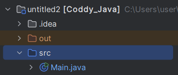

2) Правой кнопкой мыши нажимает по `src`; выбираем самый первый пункт `new`; далее `Package`:

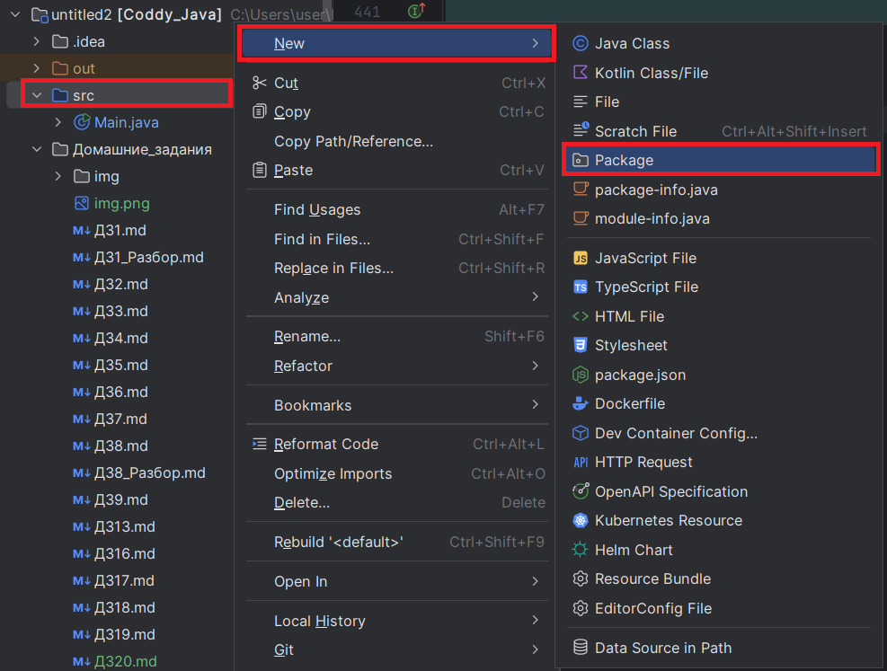

3) В появившемся окошке указываем название папки: `resources`

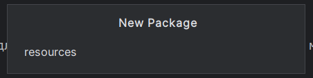

4) Должно получиться так:

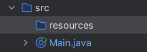

Теперь нам нужно задать, что именно эта папка будет отвечать за хранение файлов:

5) В правом верхнем углу находим шестеренку и переходим в раздел `Project Structure...`

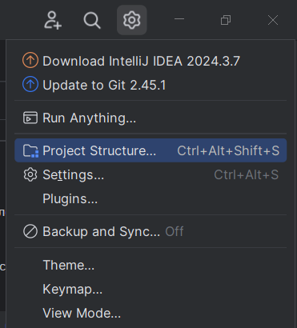

6) В появившемся меню переходим в раздел `Modules`

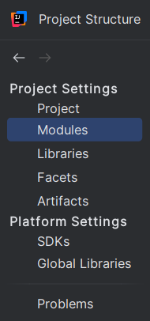

7) Находим и выбираем созданную папку:

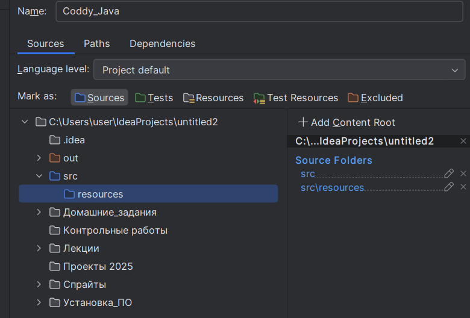

8) Выбираем, что эта папка теперь будет `Resources`:

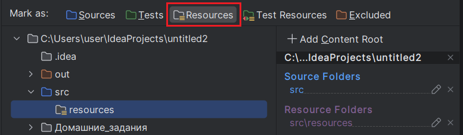

Обратите внимание, что значок папки изменился

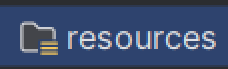

9) В нижнем правом углу по очереди нажимает на `Apply` и `OK`:

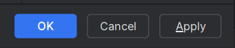

10) Проверяем, что в структуре проекта у созданной папки поменялся значок:

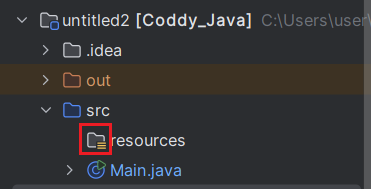