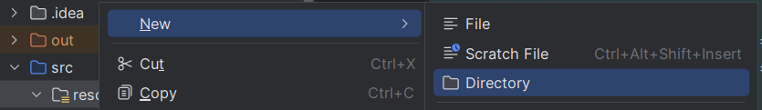
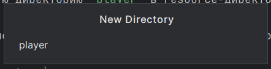
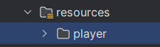
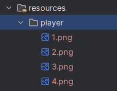
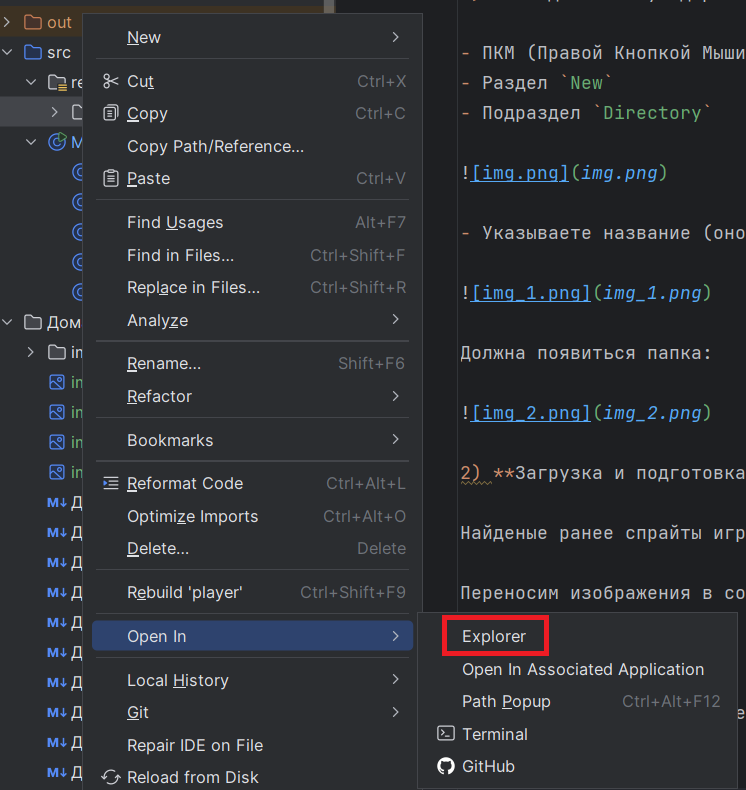
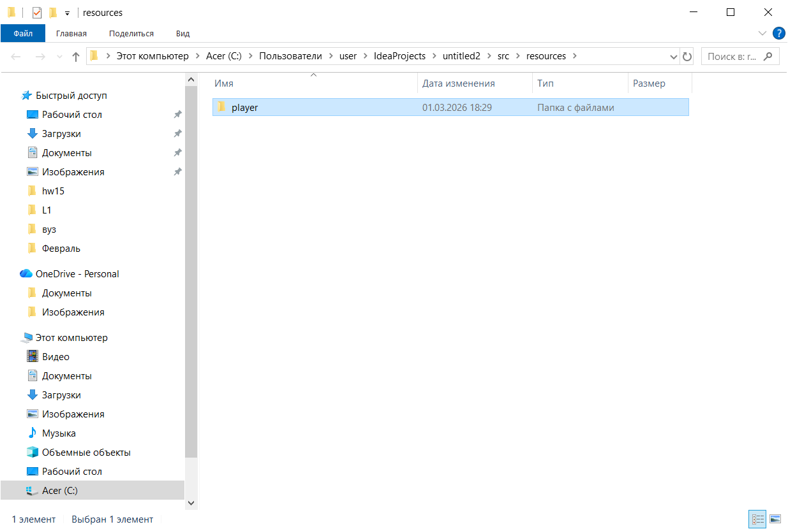
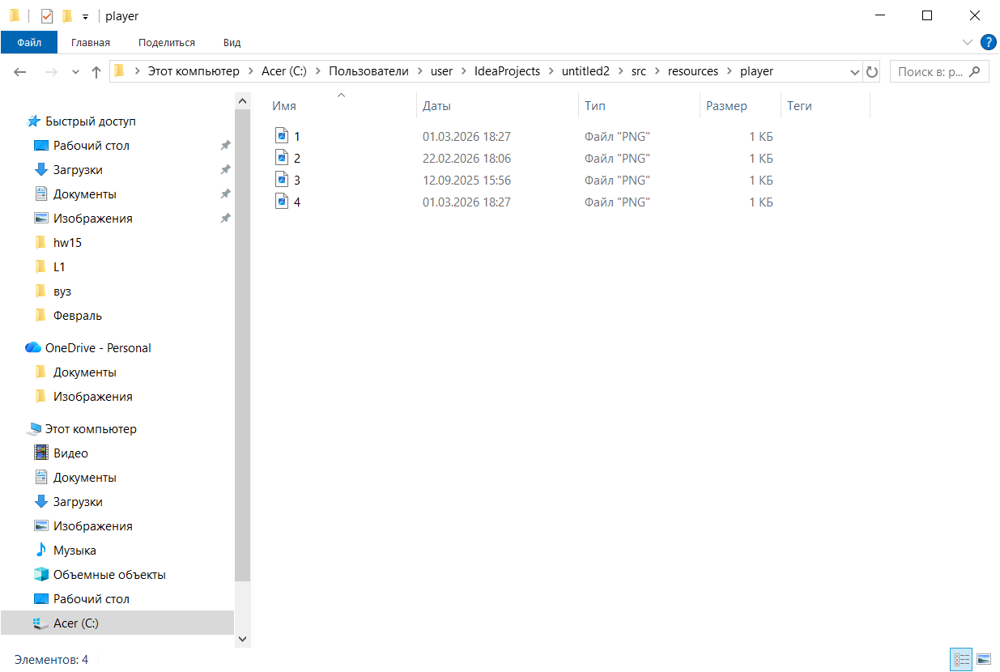

# ДЗ №21 (с 01.03.26 до 15.03.26)

---

---

### Введение

На последнем занятии мы написали класс `SpriteLoader`, который загружает изображения из source-директории, преобразует их в список двумерных массивов для дальнейшего использования в проекте для отрисовки персонажа. В дальнейшем мы будем использовать этот класс не только для загрузки игрока, но и других объектов, например платформ, врагов, окружения.

---

---

### Задание №1

Необходимо дописать написанный код и внести поправки, т.к. теперь мы используем список `ArrayList` для хранения спрайтов, а не массив. 

**Готовый код:**

```java
import java.awt.event.KeyEvent;
import java.awt.event.KeyListener;
import java.io.IOException;
import java.io.InputStream;
import java.util.ArrayList;

import java.awt.image.BufferedImage;

public class Main {
    public static void main(String[] args) {
        SwingUtilities.invokeLater(() -> {
            JFrame frame = new JFrame("PixelArt");
            frame.setDefaultCloseOperation(JFrame.EXIT_ON_CLOSE);

            frame.add(new Game());
            frame.pack();
            frame.setLocationRelativeTo(null);
            frame.setVisible(true);
        });
    }
}

class Player {
    private double x;
    private double y;

    private double velX;
    private double velY;

    private final double jumpStrength = -12;
    private final double speedStrength = 4;

    private final double gravity = 0.5;

    private boolean onGround = true;

    private static final int PIXEL_SIZE = 4;

    private final ArrayList<Color[][]> SPRITES;

    private int currentFrame = 0;
    private int tickFrame = 0;

    public Player(double x, double y) {
        this.x = x;
        this.y = y;
        SPRITES = SpriteLoader.loadSprites("player");
    }

    public void applyGravity() {
        velY += gravity;
    }

    public void update() {
        x += velX;
        y += velY;

        if (velX != 0) {
            tickFrame++;
            if (tickFrame > 8) {
                currentFrame = (currentFrame + 1) % SPRITES.size();
                tickFrame = 0;
            }
        } else {
            currentFrame = 0;
            tickFrame = 0;
        }
    }

    public void checkCollision(Rectangle platform) {
        Color[][] firstSprite = SPRITES.get(0);

        int width = firstSprite[0].length;
        int height = firstSprite.length;

        Rectangle playerBounds = new Rectangle(
                (int) x,
                (int) y,
                width * PIXEL_SIZE,
                height * PIXEL_SIZE
        );

        if (playerBounds.intersects(platform)) {
            Rectangle intersection = playerBounds.intersection(platform);

            if (intersection.height < intersection.width) {
                // Выше платформы
                if (y < platform.y) {
                    y -= intersection.height;
                    onGround = true;
                } else { // Ниже платформы
                    y += intersection.height;
                }
                velY = 0;
            } else {
                // Слева от платформы
                if (x < platform.x) {
                    x -= intersection.width;
                } else { // Справа от платформы
                    x += intersection.width;
                }
                velX = 0;
            }
        }
    }

    public void moveLeft() {
        velX = -speedStrength;
    }

    public void moveRight() {
        velX = speedStrength;
    }

    public void stop() {
        velX = 0;
    }

    public void jump() {
        if (onGround) {
            velY = jumpStrength;
            onGround = false;
        }
    }

    public void draw(Graphics2D g2d) {
        Color[][] sprite = SPRITES.get(currentFrame);
        for (int row = 0; row < sprite.length; row++) {
            for (int col = 0; col < sprite[row].length; col++) {
                if (sprite[row][col] != null) {
                    g2d.setColor(sprite[row][col]);
                    g2d.fillRect(
                            (int) x + col * PIXEL_SIZE,
                            (int) y + row * PIXEL_SIZE,
                            PIXEL_SIZE,
                            PIXEL_SIZE);
                }
            }
        }
    }
}

class Game extends JPanel implements KeyListener, ActionListener {
    private Player player;

    private boolean leftPressed = false;
    private boolean rightPressed = false;

    private final ArrayList<Rectangle> platforms = new ArrayList<>();

    public Game() {
        setPreferredSize(new Dimension(800, 600));
        setBackground(new Color(225, 149, 48));
        setFocusable(true);
        addKeyListener(this);
        player = new Player(100, 400);

        platforms.add(new Rectangle(0, 500, 2000, 100));
        platforms.add(new Rectangle(300, 420, 120, 20));
        platforms.add(new Rectangle(500, 350, 120, 20));
        platforms.add(new Rectangle(750, 300, 120, 20));

        Timer timer = new Timer(16, this);
        timer.setRepeats(true);
        timer.start();
    }

    @Override
    public void actionPerformed(ActionEvent e) {
        update();
        repaint();
    }

    private void update() {
        player.applyGravity();

        if (leftPressed) player.moveLeft();
        if (rightPressed) player.moveRight();
        if (!leftPressed && !rightPressed) player.stop();

        player.update();

        for (Rectangle platform : platforms) {
            player.checkCollision(platform);
        }
    }

    @Override
    protected void paintComponent(Graphics g) {
        super.paintComponent(g);
        Graphics2D g2d = (Graphics2D) g;

        g2d.setColor(new Color(0, 0, 0));
        for (Rectangle platform : platforms) {
            g2d.fill(platform);
        }

        player.draw(g2d);
    }

    @Override
    public void keyPressed(KeyEvent e) {
        int keyCode = e.getKeyCode();

        if (keyCode == KeyEvent.VK_A) leftPressed = true;
        if (keyCode == KeyEvent.VK_D) rightPressed = true;
        if (keyCode == KeyEvent.VK_SPACE) player.jump();
    }

    @Override
    public void keyReleased(KeyEvent e) {
        int keyCode = e.getKeyCode();

        if (keyCode == KeyEvent.VK_A) leftPressed = false;
        if (keyCode == KeyEvent.VK_D) rightPressed = false;
    }

    @Override
    public void keyTyped(KeyEvent e) {
    }
}

class SpriteLoader {
    public static ArrayList<Color[][]> loadSprites(String dir_path) {
        ArrayList<Color[][]> sprites = new ArrayList<>();

        for (int i = 1; i <= 4; i++) {
            try (InputStream is = SpriteLoader.class.getResourceAsStream(dir_path + "/" + i + ".png")) {
                BufferedImage image = ImageIO.read(is);
                sprites.add(loadColors(image));
            } catch (IOException e) {
                e.printStackTrace();
            }
        }
        return sprites;
    }

    public static Color[][] loadColors(BufferedImage image) {
        int width = image.getWidth();
        int height = image.getHeight();

        Color[][] colors = new Color[height][width];

        for (int y = 0; y < height; y++) {
            for (int x = 0; x < width; x++) {
                int argb = image.getRGB(x, y);
                Color c = new Color(argb, true);

                if (c.getAlpha() == 0) {
                    colors[y][x] = null;
                } else {
                    colors[y][x] = new Color(c.getRed(), c.getGreen(), c.getBlue());
                }
            }
        }
        return colors;
    }
}
```

---

---

### Задание №2

Пока что в наш платформер могут загружаться только 4 спрайта игрока. Нужно это немного поправить.

Ранее у вас было задание найти другие спрайты. Теперь их нужно подключить:

1) **Создайте новую директорию `player` в resource-директории:**

- ПКМ (Правой Кнопкой Мыши) по resource-директории, которую вы должны были создать в прошлом ДЗ
- Раздел `New`
- Подраздел `Directory`



- Указываете название (оно на самом деле может быть любым, но чтобы четко понимать, что это папка будет отвечать за спрайты игрока, лучше назвать `player`)



Должна появиться папка:



2) **Загрузка и подготовка изображений:**

Найденные ранее спрайты игрока переназываем в 1.png, 2.png, 3.png и так далее, в зависимости от того, сколько у вас спрайтов в анимации игрока

Переносим изображения в созданную папку `player`, через проводник:



**Как открыть папку с проектом в проводнике, если не знаете где у вас на компьютере он сохранен:**

- ПКМ по папке `player`
- Раздел `Open In`
- Подраздел `Explorer`



- Откроется проводник, где будет папка `player`



- Заходим в папку и загружаем картинки



3) **Правка кода в `SpriteLoader`:**

Если у вас, например `20` спрайтов, в классе `SpriteLoader` в методе `loadSprites` нужно поправить цикл:

**Было:**

```java
for(int i = 1; i <= 4; i++) {
    // Остальной код
}
```

**Стало:**

```java
for(int i = 1; i <= 20; i++) {
    // Остальной код
}
```

Это нужно, что наш загрузчик загрузил именно столько спрайтов, сколько нужно - ни больше, ни меньше

4) **Правка кода в `Player`:**

Т.к. спрайты должны загрузиться в класс `Player`, в конструкторе есть загрузка: 

```java
public Player(double x, double y) {
        this.x = x;
        this.y = y;
        SPRITES = SpriteLoader.loadSprites("player");
}
```

Если вы при создании папки со спрайтами для игрока назвали ее иначе, например `PlayerSprites` необходимо это указать, иначе спрайты не загрузятся:

**Было:**

```java
SPRITES = SpriteLoader.loadSprites("player");
```

**Стало:**

```java
SPRITES = SpriteLoader.loadSprites("PlayerSprites");
```

---

---

### Задание №3

Постарайтесь написать класс `Platform`, который будет отвечать за создания платформ. Что должно быть в классе:

- Координаты расположения: `double x` и `double y`
- Размер одного пикселя: `int PIXEL_SIZE`
- Набор спрайтов (на тот случай, если у платформ тоже есть какая-то анимация): `ArrayList<Color[][]> SPRITES`
- Конструктор, который принимает параметры координат и загружает спрайты
- Метод `public void draw(Graphics2D g2d)`, который отрисовывает платформу

**Подсказка:** все необходимое есть в классе `Player`, делайте по аналогии

Пока что этот класс не нужно встраивать в программу - этим мы займемся на занятии