# ДЗ №22 (с 15.03.26 до 22.03.26)

---

---

### Введение

Знакомимся с системой версионирования (контроля версий) git и веб-платформой для хранения и управления своих проектов - github. На занятии мы:

- зарегистрировались на github
- подключили git на ноутбуки
- создали свой первый `commit`
- сделали `push` проекта на github
- внести измения на платформе, добавив README - файл
- обновили проекты на ноутбуках, сделав `update`

--- 

---

### Задание №1

В первом задании вы подключите git на своих домашних компьютерах, войдете в аккаунты и загрузите проекты к себе

---

1) **Подключение git**

- Откройте любой проект

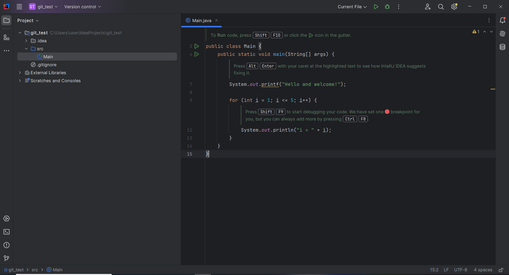

- В верхнем левом углу раскройте меню управления проектом

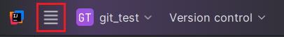

- В появившихся разделах выбираем "VCS" (Version Control System). Ввыбираем пунк "Enable Version Control Integration..."

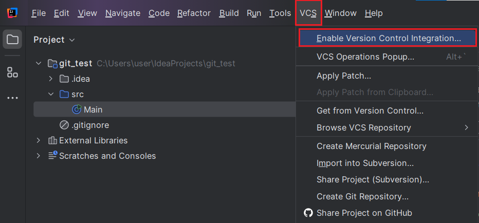

- В появившемся окне проверяем, что указана система "git", после чего нажимаем на кнопку "ОК"

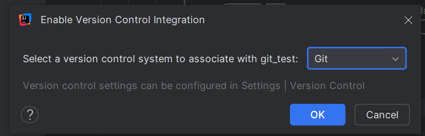

- Внимательно смотрим в нижний правый угол среды разработки

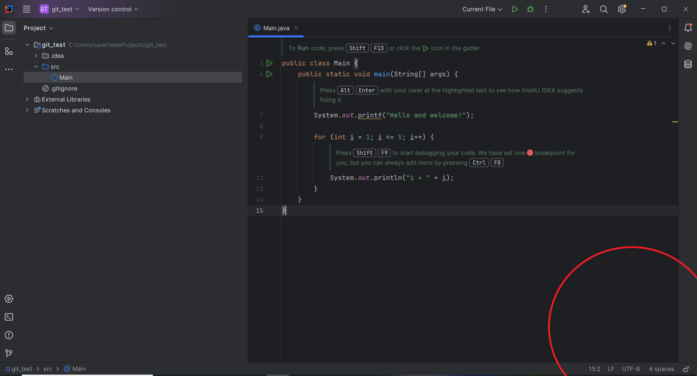

- Если там появляется ошибка "Git is not installed", нажимаем на в окошке этой ошибки "Download and Install" (может быть просто "Download" или "Install")

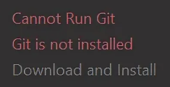

- Ждем пока закончится загрузка, после чего проверяем, что git подключился к проекту:

Если все установилось в верней части появится кнопка "master"

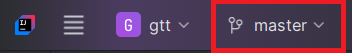

А в раскрытом меню управления вместо кнопки "VCS" появится "Git"

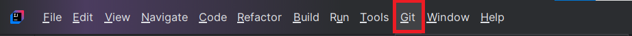

**!!! Если данные кнопки не появились, попробуйте повторить действия сначала !!!**

---

2) **Подключение аккаунта**

- Переходим в раздел "Git" и выбираем пункт "Clone..." (склонировать, скопировать)

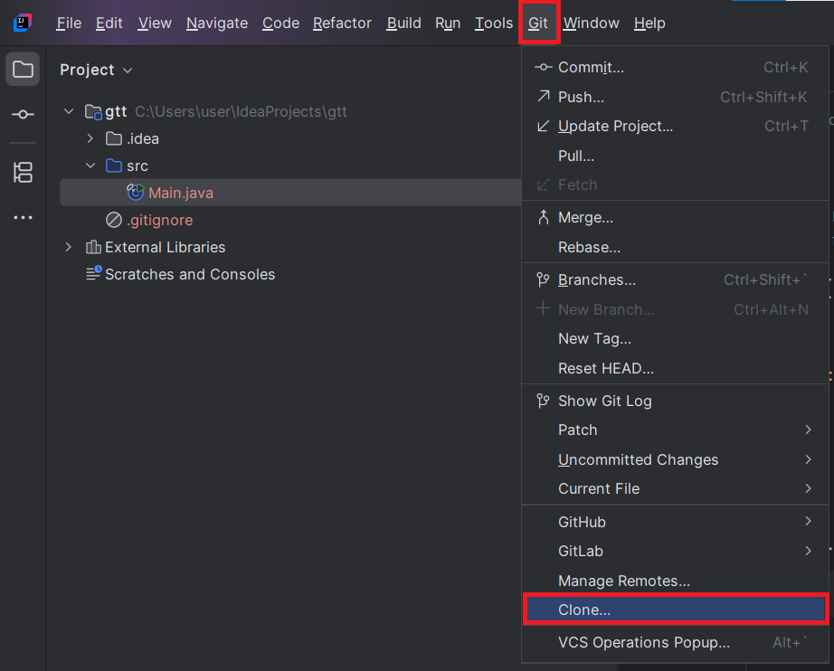

- В появившемся окне переходим в раздел "GitHub"

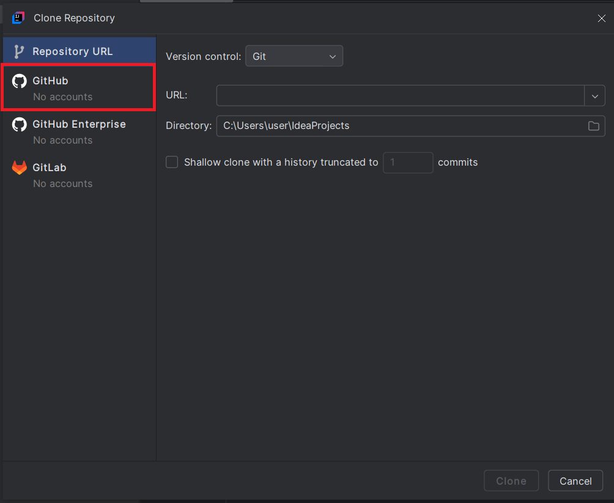

- Выбираем опцию "Log in via GitHub..."

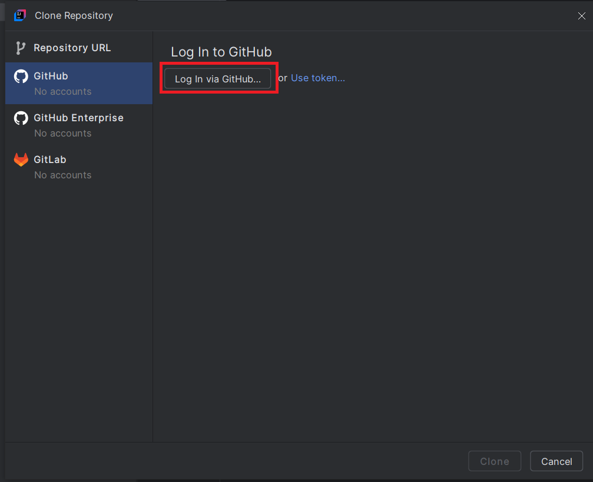

После чего в браузере откроется вкладка авторизацией

- Нажимаем на "Authorize in GitHub"

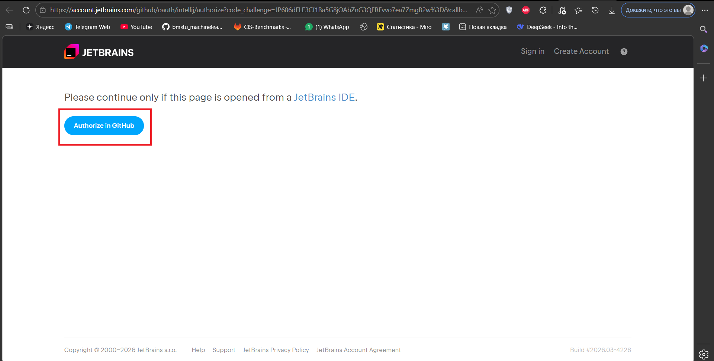

- После чего входим в свои аккаунты на github

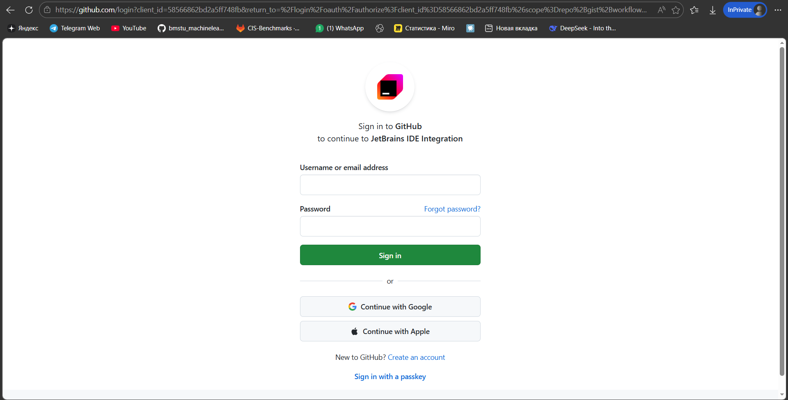

- Если вы успешно вошли в аккаунт появится сообщение:

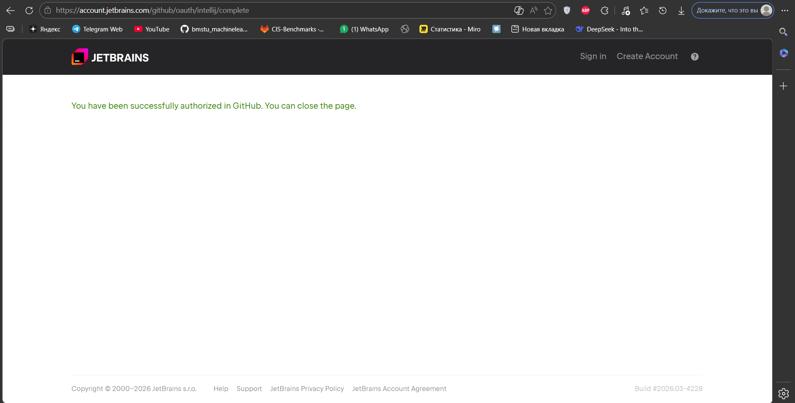

---

3) **Клонирование проекта**

После успешного входа в аккаунт, возвращаемся в IntelliJ IDEA. Как только аккаунт будет подключен, у вас появится список всех ваших сохраненных на GitHub проектов.

- Выбираете созданный на занятии проект (по названию) и нажимаете на "Clone"

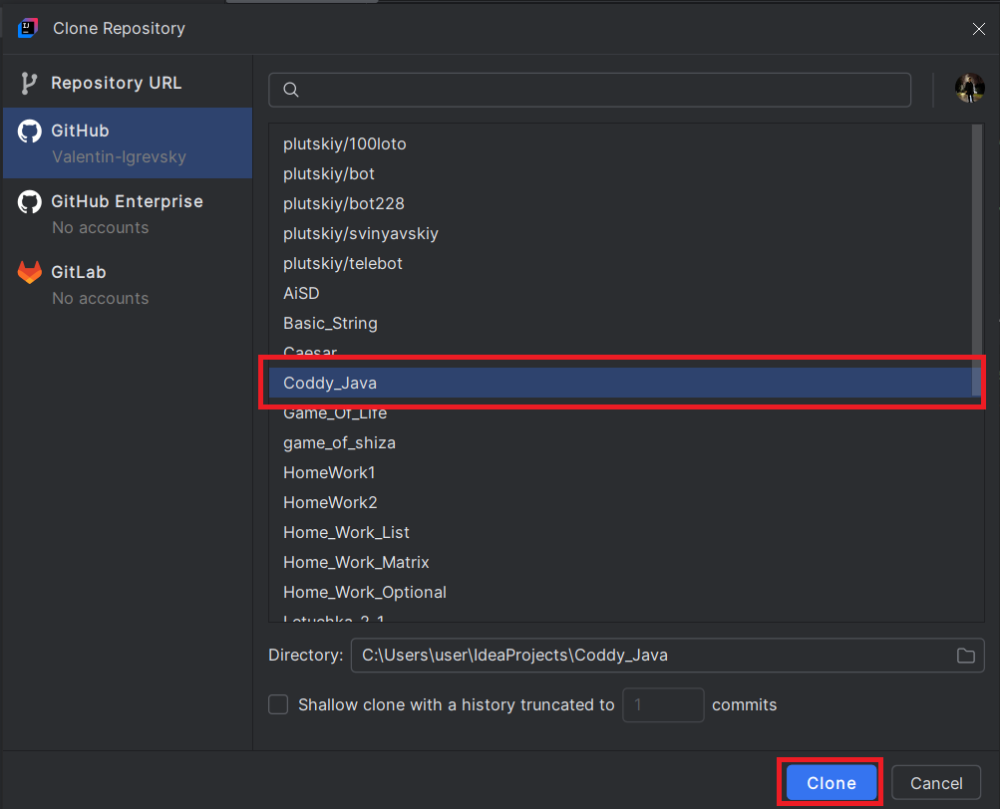

- После загрузки появится окно, где желательно выбрать "This Window", чтобы склонированный проект открылся в текущем окне программы, а не в новом

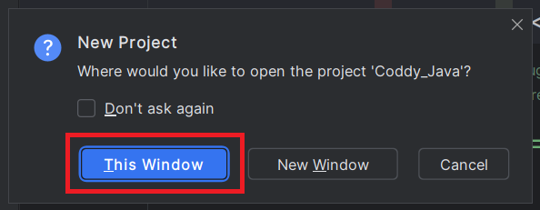

- Может появиться окно с предупреждением. Если такое окно появилось, выбираем "Trust Project"

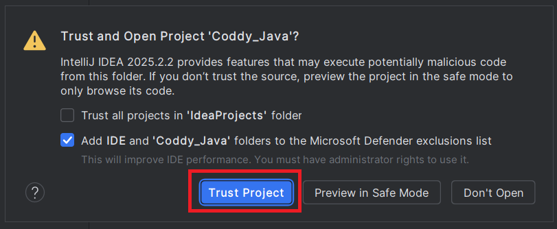

- Если на предыдущем этапе ничего не изменяли в появившемся окне, появится такое окно. Выбираем "Да"

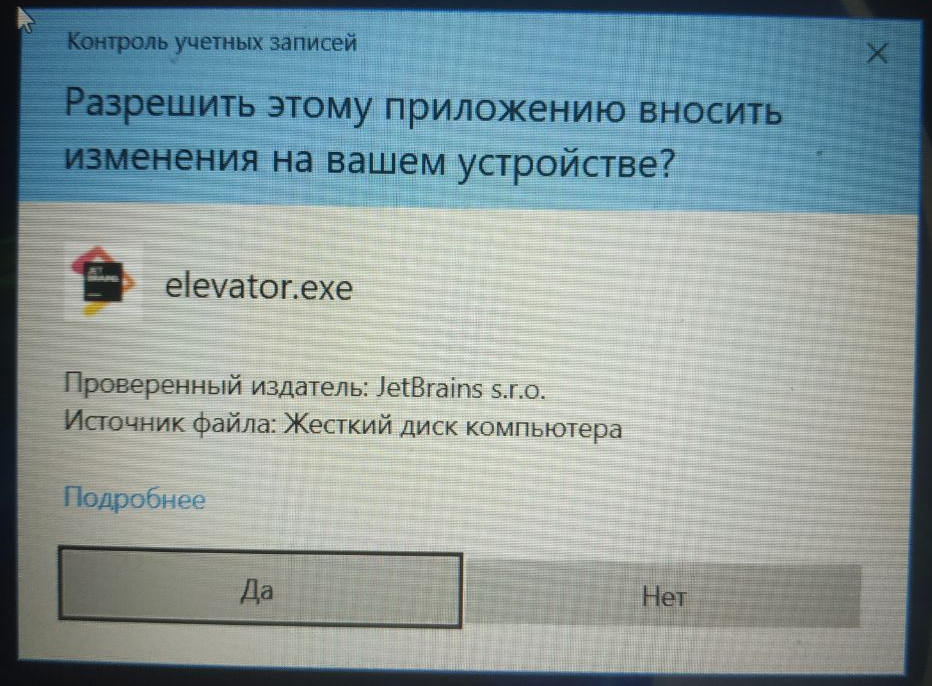

- У вас открывается ваш проект:

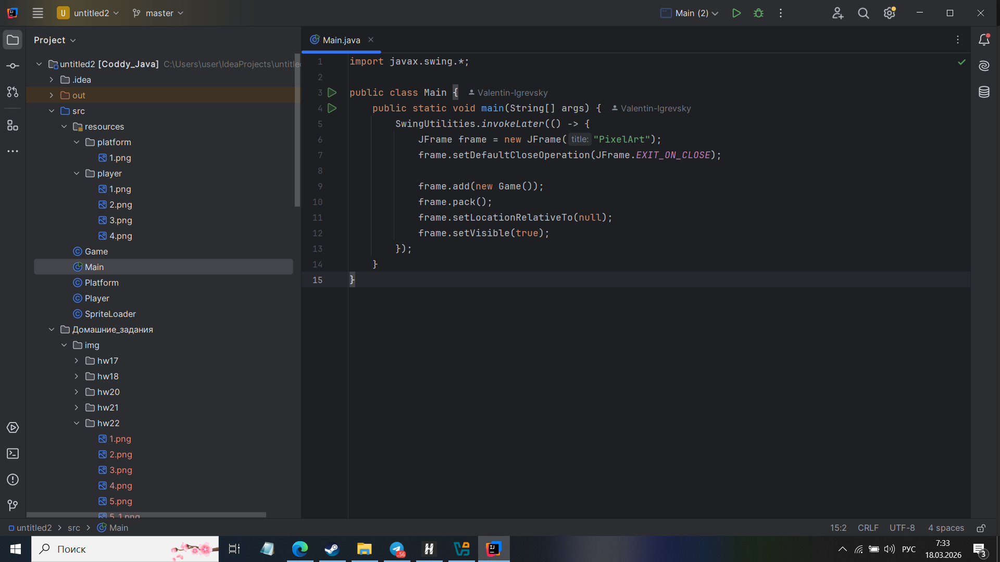

---

---

### Задание №2

1) **Создание нового файла и добавление в git**

- В проекте в разделе src, создайте новый Java Class:

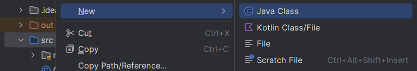

- Дайте классу название Platform - этот класс нам понадобится на занятии

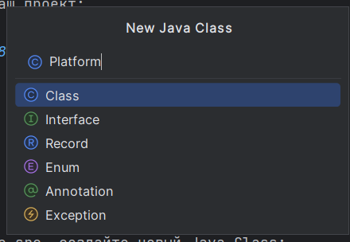

- После создания, появится окно с вопросом "Нужно ли добавить созданный файл в git-систему" - выбираем "Add"

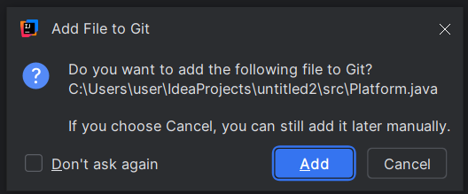

- В созданном классе напишите следующий код (прикладываю готовый, т.к. дз на работу с git и github):

```java
import java.awt.*;

class Platform {
    private double x;
    private double y;

    private static final int PIXEL_SIZE = 4;

    private final Color[][] SPRITE;

    private int currentFrame = 0;

    public Platform(double x, double y, String spritePath) {
        this.x = x;
        this.y = y;
        this.SPRITE = SpriteLoader.loadSprites(spritePath).getFirst();
    }

    public void draw(Graphics2D g2d) {
        for (int row = 0; row < this.SPRITE.length; row++) {
            for (int col = 0; col < this.SPRITE[row].length; col++) {

                if (this.SPRITE[row][col] != null) {
                    g2d.setColor(this.SPRITE[row][col]);

                    g2d.fillRect(
                            (int)x + col * PIXEL_SIZE,
                            (int)y + row * PIXEL_SIZE,
                            PIXEL_SIZE,
                            PIXEL_SIZE
                    );
                }
            }
        }
    }
}
```

---

2) **Создание commit`a**

- Создайте `commit`. Для этого переходим в соответствующий раздел в левой панели:

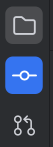

- Выберите измененные в проекте файлы (как минимум должен быть файл с классом `Platform`)

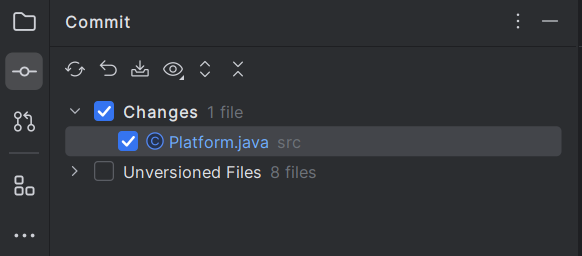

- Добавьте комментарий в поле ниже "Commit Message":

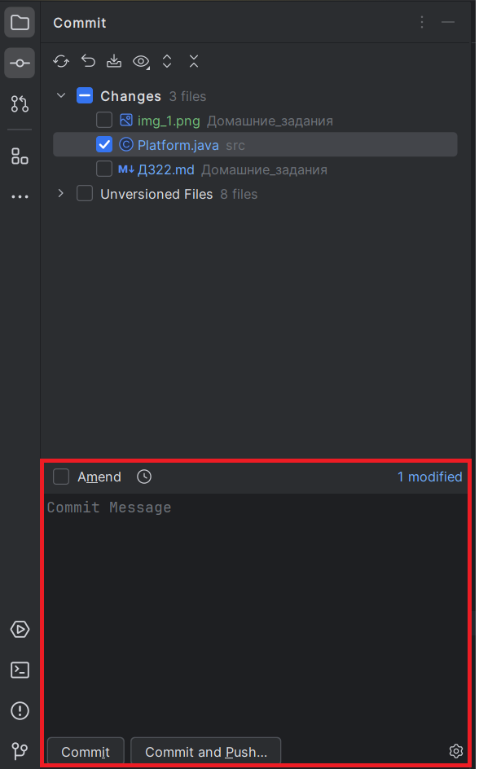

Примеры:

- `Домашнее задание №22`
- `Добавил класс Platform`
- `ADD Platform.java`

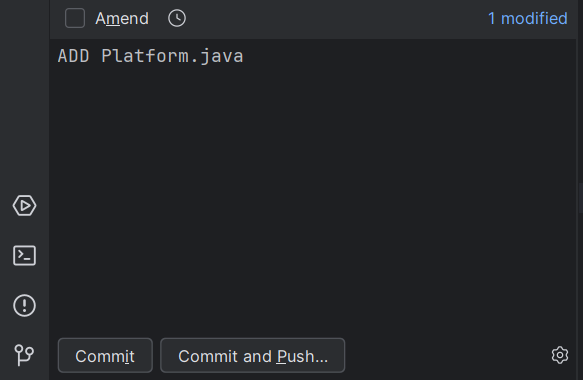

- Нажмите на кнопку "Commit"

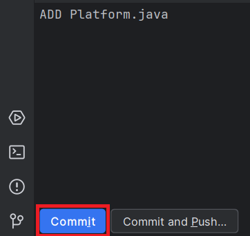

Если все сделано правильно, все отмеченные и закоммиченные файлы пропадут из списка:

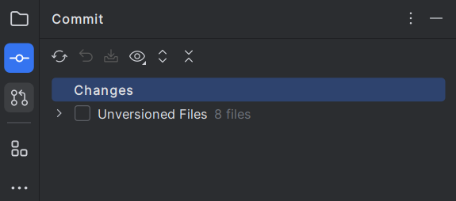

---

3) **Загрузка на GitHub**

После создания коммита, новую версию проекта нужно загрузить на GitHub:

- В верхней части на кнопке `master`, должна была появиться зеленая стрелочка, подсказывающая, что есть измения, который можно загрузить на GitHub:

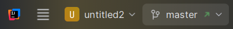

- Нажимаем на кнопку `master`: 

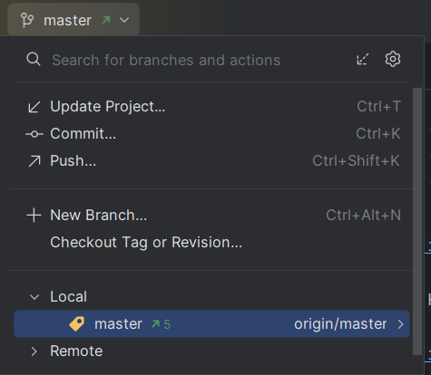

- Выбираем пункт "Push..."

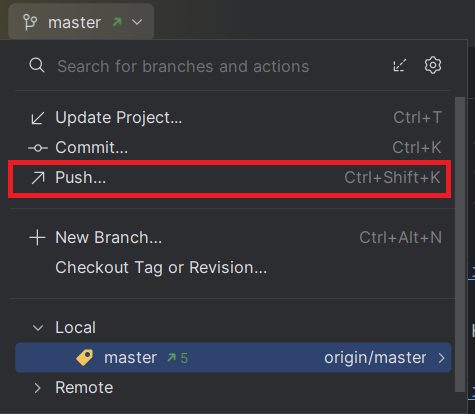

- В открывшемся меню нажимает на синюю кнопку "Push":

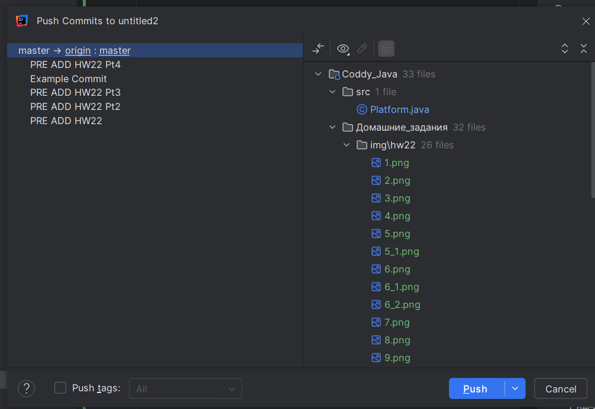

- В нижнем правом углу должно появиться сообщение:


---

4) **Проверка**

После выполнения push-команды на GitHub должны появиться изменения в вашем проекте. Можете зайти и самостоятельно посмотреть.

