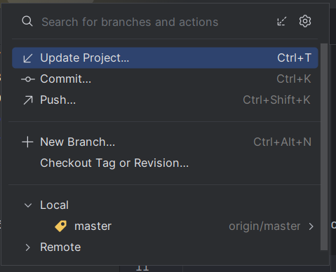
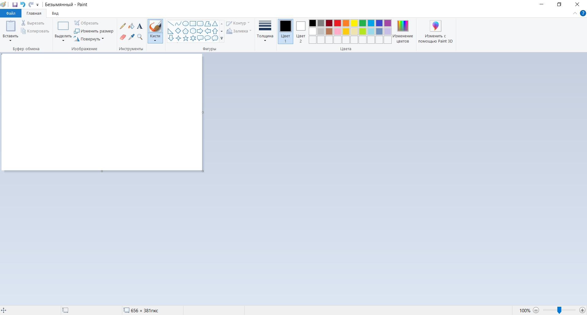
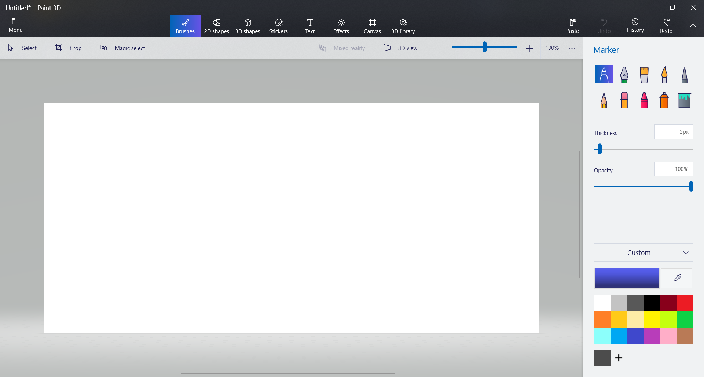
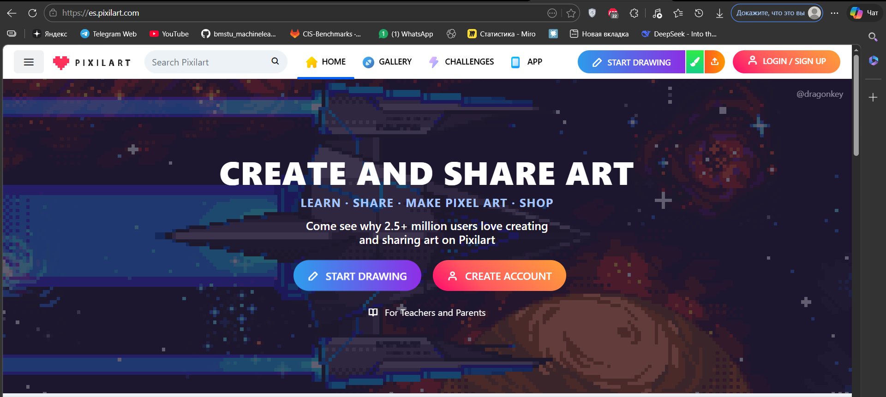

# ДЗ №22 (с 15.03.26 до 22.03.26)

---

---

### Задание №0 - Начало

Перед выполнением основных заданий не забудьте обновить проект на своих домашних компьютерах, т.е. подгрузить изменения с GitHub, используя команду `Update Project`.



После подгрузки убедитесь в том, что все работает. Если нет - необходимо дописать код, написанный на занятии. Все необходимые материалы тут: [файлы проекта](./../src)

---

---

### Задание №1 - Творческое

Т.к. мы постепенно внедряем разные объекты в проект, им нужны текстуры. Текстуры [платформ](./../src/resources/platform/1.png) и [поля](./../src/resources/platform/2.png) были нарисованы на скорую руку для примера, поэтому вам нужно подключить свои текстуры, которые находили ранее, или нарисовать их самостоятельно.

Свои текстуры можно нарисовать в:

- Предустановленная на компьютер программа `Paint`



- `Paint 3D` (может не быть на компьютере)



- Веб-сайт `es.pixilart.com`



Текстуры нужно сохранить в соответствующую папку (resources/platform/) и поправить названия файлов в коде:

```java
platforms.add(new Platform(0, 500, "platform/2.png"));
platforms.add(new Platform(300, 420, "platform/1.png"));
platforms.add(new Platform(500, 350, "platform/1.png"));
platforms.add(new Platform(750, 300, "platform/1.png"));
platforms.add(new Platform(800, 400, "platform/1.png"));
```

Также можете создать и использовать разные текстуры разных размеров.

---

---

### Задание №2 - Творческое

Попробуйте создать небольшой уровень из платформ. Если добавляли свои платформы других размеров используйте и их.

---

---

### Задание №3 - Практика

На занятии мы добавили возможность устанавливать платформы по нажатию ЛКМ. Это был небольшой пример, чтобы научиться обрабатывать нажатия клавиш мыши. Теперь вам необходимо:

1) В классе `Player`:
   - Создать целочисленное поле `health` с каким-то изначальным значением (например 100)
   - Добавить методы `damage`, чтобы наносить урон игроку
   - Добавить методы `heal`, чтобы лечить игрока
   - Метод `getHealth`, чтобы можно было посмотреть здоровье игрока

2) В классе `Game` в методе `mousePressed`
   - По нажатию ЛКМ - наносить урон игроку (например 10)
   - По нажатию ПКМ - лечить игрока (например на 10)

**Подсказка:** Название ПКМ - `BUTTON3`

---

---

### Задание №4 - Практика

1) Внимательно рассмотрите классы `Player` и `Platform`. Выделите похожие части, например поля или методы.
2) Напишите класс `GameObject` (обязательно в отдельном файле), в котором будут реализованы одинаковые элементы классов `Player` и `Platform`.

---

---

### Задание №5 - Завершение

Сделайте `commit` со всеми изменениями в проекте и загрузите на GitHub - `push`