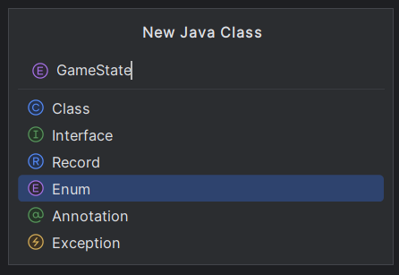

# Итоги занятий 12.04.26

- Написали универсальный Interface `Damageable`, позволяющий добавить и реализовать методы для взаимодействия со здоровьем/прочностью любого игрового объека
- Добавили интерфейс к игроку (класс `Player`) и реализовали необходимые методы
- Написали универсальный класс `HealthBar`, позволяющий визуально отображать здоровье объекта. Для этого:
  - Разобрались, о каких объектах должна быть информация внутри класса:
    - Объект, рядом с которым будет отображаться здоровье
    - Объект, чье здоровье будет отображаться
    - P.s. такой подход позволяет гибко настраивать расположение полоски здоровья
  - Расчитали координаты расположения относительно другого объекта
  - Написали метод отрисовки с градиентным переходом
- Подключили `HealthBar` к игроку
- Протестировали работоспособность

---

---

# ДЗ №26 (с 12.04.26 до 19.04.26)

---

---

### Задание №1 - Добавить несколько новых объектов в проект:

##### Физические декорации

Нам хотелось бы иметь у себя в проекте, например, бочки и коробки, которые можно будет двигать и стоять на них. Для этого создадим новый класс:

```java
class PhysicsDecoration extends PhysicsObject {
    public PhysicsDecoration(double x, double y, String spritePath) {
        super(x, y);
        this.SPRITE = SpriteLoader.loadSprite(spritePath);
    }
}
```

---

##### Объекты, наносящие урон

Чтобы платформер был платформером, нужны какие-то объекты, которые будут наносить урон игроку:

```java
class DamageZone extends GameObject {
  private final int damage;

  private int cooldown = 0;
  private final int maxCooldown = 30;

  public DamageZone(double x, double y, String spritePath, int damage) {
    super(x, y);
    this.SPRITE = SpriteLoader.loadSprite(spritePath);
    this.damage = damage;
  }

  public void update() {
    if (cooldown > 0) cooldown--;
  }

  public void checkCollision(GameObject obj) {
    if (cooldown > 0) return;
    if (this.getBounds().intersects(obj.getBounds())) {

      if (obj instanceof Damageable target) {
        target.damage(damage);
        cooldown = maxCooldown;
      }
    }
  }
}
```

Что важно нопимать в этом классе:
- Это универсальный класс для объектов, наносящих урон. Два отличия у разных объектов:
  - Текстура (прайт), которую вы можете задать самомстоятельно
  - Урон, получаемый при касании - тоже можно задать самостоятельно
- Т.к. проверна на коллизию с объектом будет проверяться 60 раз в секунду (60 FPS), нам не хотелось бы, чтобы игрок умер за 2 секунды, с учетом, что получаемый урон равен 1. Поэтому есть система задержки перед следующим нанесением урона - `cooldown`. После получения урона, у игрока будет 0.5 секунды (30 кадров) перед получением следующего урона.
- Дополнительный блок проверки. Т.к. урон могут получать только объекты с интерфейсом `Damageable`, делается  проверка:  `if (obj instanceof Damageable target)`. Если объект с которым проверяется коллизия имеет такой интерфейс, он получит урон, если нет - ничего не произойдет

---

---

### Задание №2 - Добавление состояния игры:

Чтобы улучших платформер, добивим сисмтему состояний игры:
- Пауза
- Игра запущена
- Игра окончена

Для этого создайте новый Java-класс, но укажите, что это `Enum`, дайте название `GameState`:



```java
enum GameState {
    PLAYING,
    GAME_OVER,
    PAUSE
}
```

В классе `Game`:

- Добавьте поле:

```java
private GameState state = GameState.PLAYING;
```

- В методе `keyPressed` добавьте смену состояния игры с `PLAYING` на `PAUSE` и обратно по нажатию клавиши `P`:
  
```java
if (keyCode == KeyEvent.VK_P) {
    switch (state) {
        case GameState.PLAYING -> state = GameState.PAUSE;
        case GameState.PAUSE -> state = GameState.PLAYING;
    }
}
```

- Напишите метод проверки остановки игры (`GameState.GAME_OVER`) при смерти игрока:

```java
private void checkGameOver() {
    if (player.getHealth() <= 0) {
        state = GameState.GAME_OVER;
    }
}
```
- Подумайте где должны быть проверки на состояние игры (Подсказка: они должны быть в одном из методов класса `Game` - в каком?)

---

---

Все нововведения с занятия и для ДЗ есть в папке [src](./../src)
