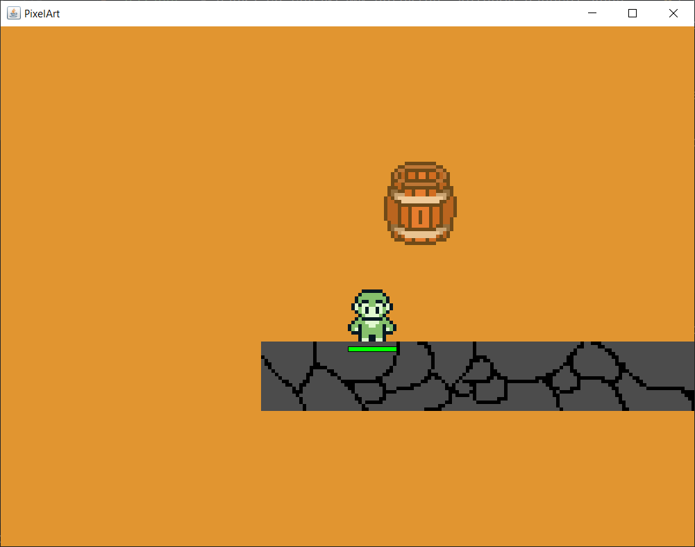
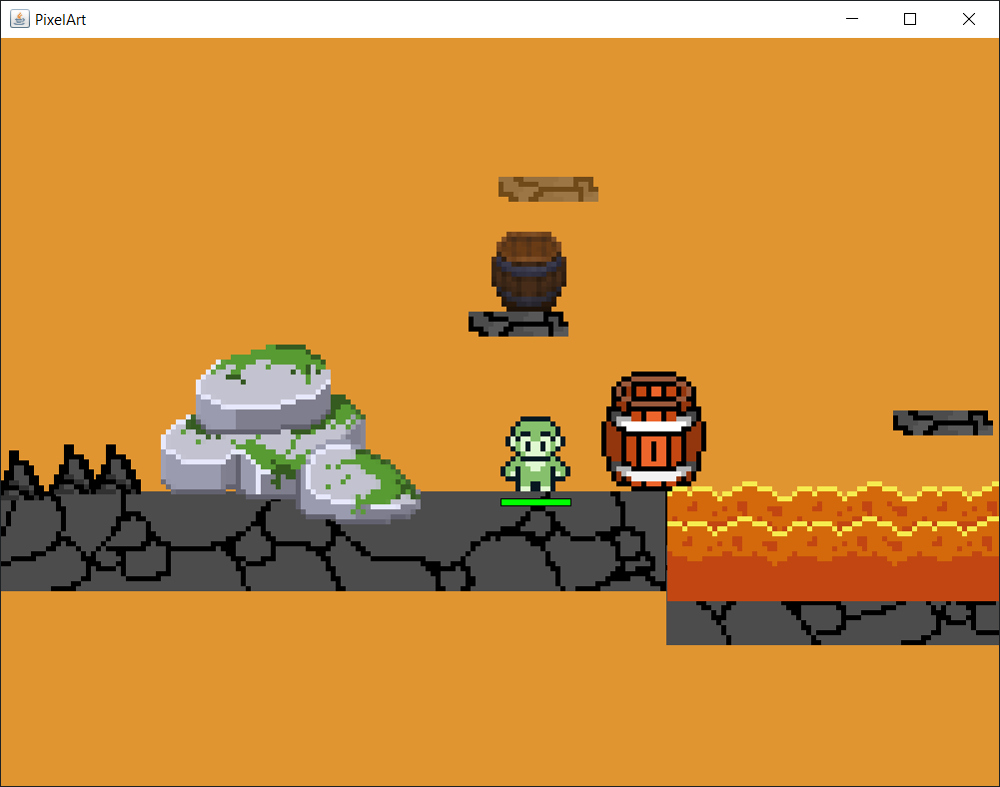
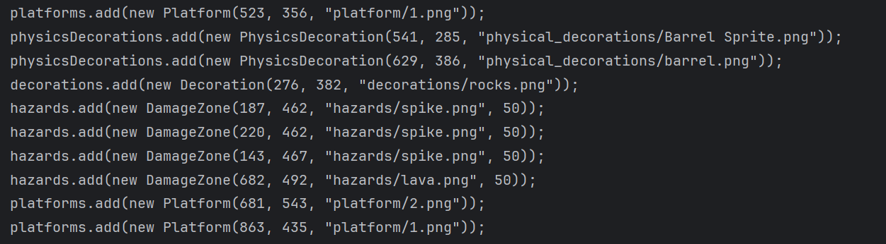
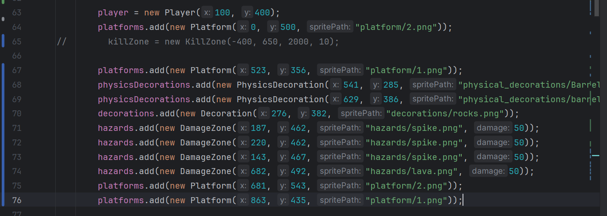
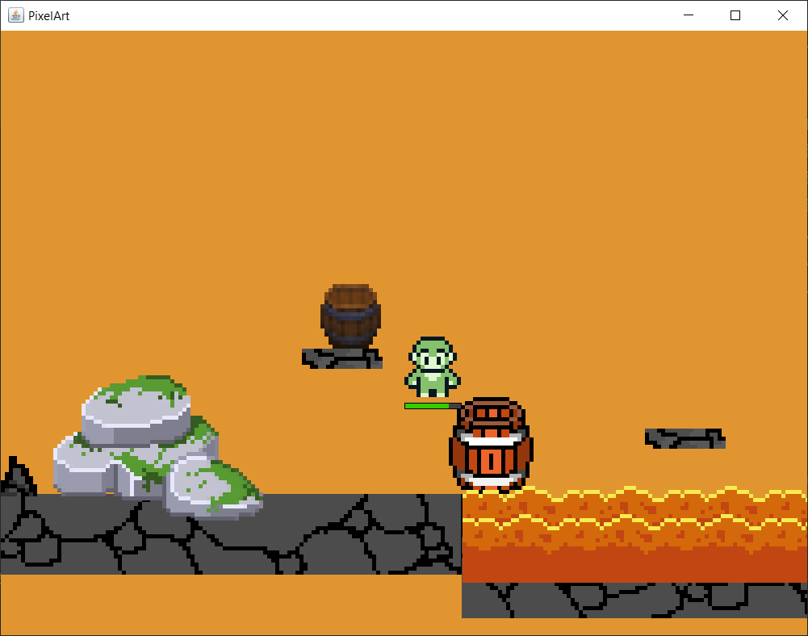

# ДЗ №27 (с 19.04.26 до 26.04.26)

---

---

### Задание №1 - Добавить несколько новых объектов в проект:

##### Обычные декорации

```java
class Decoration extends GameObject {
  public Decoration(double x, double y, String spritePath) {
    super(x, y);
    this.SPRITE = SpriteLoader.loadSprite(spritePath);
  }
}
```

---

##### Kill-зону

```java
import java.awt.*;

public class KillZone extends GameObject {
  int width;
  int height;

  public KillZone(double x, double y,int width, int height) {
    super(x, y);
    this.width = width;
    this.height = height;
  }

  @Override
  public Rectangle getBounds() {
    int width = this.width * PIXEL_SIZE;
    int height = this.height * PIXEL_SIZE;

    return new Rectangle((int) x, (int) y, width, height);
  }

  public void checkCollision(GameObject obj) {
    if (this.getBounds().intersects(obj.getBounds())) {
      if (obj instanceof Damageable target) {
        target.damage(100000);
      }
    }
  }

  @Override
  public void draw(Graphics2D g) {
    Rectangle bounds = getBounds();

    Stroke oldStroke = g.getStroke();
    float[] dashPattern = {10, 5};
    Stroke dashed = new BasicStroke(
            2,
            BasicStroke.CAP_BUTT,
            BasicStroke.JOIN_MITER,
            10,
            dashPattern,
            0
    );

    g.setStroke(dashed);
    g.setColor(Color.RED);
    g.drawRect(bounds.x, bounds.y, bounds.width, bounds.height);

    g.setStroke(oldStroke);
  }
}
```

---

---

### Задание №2 - Создание уровней

Для вашего удобства был создан интерактивный редактор уровней. Что необходимо сделать:

Добавить новый класс `PlacementTool`:

```java
import java.util.function.Consumer;
import java.util.function.BiFunction;

class PlacementTool {
    BiFunction<Integer, Integer, GameObject> factory;
    Consumer<GameObject> placer;
    String pattern;
    String name;

    public PlacementTool(
            BiFunction<Integer, Integer, GameObject> factory,
            Consumer<GameObject> placer,
            String pattern,
            String name
    ) {
        this.factory = factory;
        this.placer = placer;
        this.pattern = pattern;
        this.name = name;
    }
}
```

Полностью обновите класс `Game` -> можно найти в папке [src](./../src)

Проверьте и добавьте следующие папки в resources:
- `decorations` - папка со спрайтами обычных декораций
- `hazards` - папка со спрайтами объектов, которые наносят урон
- `physical_decorations` - папка со спрайтами декораций c которыми можно взаимодействовать
- `platform` - папка со спрайтами платформ

Добавьте во все папки соответвующие спрайты - можете найти их сами или взять примеры у меня [resources](./../src/resources)

После чего можно запускать игру. Там будет только одна платформа, однако если нажать на `Enter`, у вас появится возможность размещать любые объекты, которые есть в соответствующих папках.


Чтобы переключаться между объектами используйте стрелки вправо и влево



После того, как вы разместили объекты, у вас в консоли будут все необходимые команды (код), который можно дописать в классе `Game` и все объекты появятся при следующем запуске:









Таким образом создайте 2-3 уровня, соманды для создания объектов можно сохранить в обычном текстовом файле.

