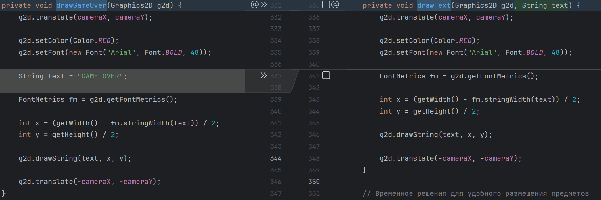

# Итоги занятия 26.04.26

- Добавили возможность масштабировать размер игры
- Добавили класс невидимых объектов `InvisibleObject` для создания других объектов на его основе, например триггеров
- Добавили интерфейс `Trigger`, который используется для выполнения каких-либо действий при активации, например касании
- Добавили фон
- Реализовали систему уровней, дописав функционал в класс `Game` и написав классы:
  - `Level` - класс для сохранения всех объектов уровня
  - `LevelLoader` - разгузчик уровней по номеру
  - `LevelExit` - триггер перехода на следующий уровень

---

---

# ДЗ №27 (с 26.04.26 до 03.05.26)

---

---

### Задание №1 - Модификая InvisibleObject

На данный момент у нас есть 2 невидимых объекта:
- Килл-зона
- Триггер перехода на следующий уровень

В дальнейшем таких объектов может становиться больше (например, в дз вы добавите триггер завершения игры победой), поэтому нам хотелось бы в редакторе чуть удобнее определять, как невидимый объекты мы устанавливаем. Т.к. у невидимых объектов в редакторе есть цветной контур, давайте использовать цвет для обозначения. Для это:

1. В классе `InvisibleObject` в методе `draw` уберите строчку  `g.setColor(Color.RED);` и удалите ее.
2. В классе `KillZone` добавьте следующий метод:

```java
@Override
public void draw(Graphics2D g) {
    g.setColor(Color.RED);
    super.draw(g);
}
```

3. В классе `LevelExit` добавьте следующий метод:
```java
@Override
public void draw(Graphics2D g) {
    g.setColor(Color.ORANGE);
    super.draw(g);
}
```

Что это нам дает? Теперь в невидимых объектах мы настраиваем цвет, которым будет нарисован контур объекта в режиме редактора

---

---

### Задание №2 - Добавление триггера завершения игры

Будем делать также, как и с `LevelExit`, для этого:

1. В перечислении `GameState` добавьте элемент `WIN`:

```java
enum GameState {
    PLAYING,
    GAME_OVER,
    PAUSE,
    WIN
}
```

2. В классе `Game` добавьте метод, который изменяет состояние игры на `WIN`:

```java
public void win() {
    state = GameState.WIN;
}
```

3. Создайте новый класс `WinTrigger`:

```java
import java.awt.*;

class WinTrigger extends InvisibleObject implements Trigger {
    public WinTrigger(double x, double y,int width, int height) {
        super(x, y, width, height);
    }

    @Override
    public void activate(GameObject obj, Game game) {
        game.win();
    }

    @Override
    public void draw(Graphics2D g) {
        g.setColor(Color.GREEN);
        super.draw(g);
    }
}
```

Теперь при взаимодействии с этим триггером, он будет вызывать метод `win` тем самым устанавливая состояние игры в победу.\

### Задание №3 - Обновление класса Game

1. Найтиде в классе `Game` метод `drawGameOver`. Переделаем его так, чтобы этот метод мог отображать не только окончание игры, но и паузу, и победу. Для этого:

- Переименуем метод в `drawText`
- Уберем строчку `String text = "GAME OVER";`
- В параметры добавим `String text`

```java
private void drawText(Graphics2D g2d, String text) {
    g2d.translate(cameraX, cameraY);

    g2d.setColor(Color.RED);
    g2d.setFont(new Font("Arial", Font.BOLD, 48));

    FontMetrics fm = g2d.getFontMetrics();

    int x = (getWidth() - fm.stringWidth(text)) / 2;
    int y = getHeight() / 2;

    g2d.drawString(text, x, y);

    g2d.translate(-cameraX, -cameraY);
}
```



2. В классе `Game` в методе `paintComponent` найдите следующий блок кода:


```java
if (state == GameState.GAME_OVER) {
    drawGameOver(g2d);
}
```

**Замените** его на:

```java
switch (state) {
    case GameState.GAME_OVER -> drawText(g2d, "Игра окончена");
    case GameState.PAUSE -> drawText(g2d, "Пауза");
    case GameState.WIN -> drawText(g2d, "Победа");
}
```

Теперь в зависимости от состояния игры на экране будет отображаться нужная надпись. 

Надписи мы можете изменить самостоятельно.

3. В классе `Game` в методе `loadTriggerTools` добавьте следующий код:

```java
tools.add(new PlacementTool(
        (x, y) -> new WinTrigger(x,y,10,10),
        obj -> triggers.add((WinTrigger) obj),
        "level.triggers.add(new WinTrigger(%s, %s, 10, 10));\n",
        "WinTrigger"
        ));
```

Весь метод должен выглядить так:

```java
    private void loadTriggerTools() {
        tools.add(new PlacementTool(
                (x, y) -> new KillZone(x, y, 50, 10),
                obj -> triggers.add((Trigger) obj),
                "level.triggers.add(new KillZone(%s, %s, 50, 10));\n",
                "KillZone"
        ));

        tools.add(new PlacementTool(
                (x, y) -> new LevelExit(x, y, 10, 10),
                obj -> triggers.add((Trigger) obj),
                "level.triggers.add(new LevelExit(%s, %s, 10, 10));\n",
                "LevelExit"
        ));

        tools.add(new PlacementTool(
                (x, y) -> new WinTrigger(x,y,10,10),
                obj -> triggers.add((WinTrigger) obj),
                "level.triggers.add(new WinTrigger(%s, %s, 10, 10));\n",
                "WinTrigger"
        ));
    }
```

Данное добавление позволит в редакторе размещать триггер завершения игры

### Задание №4 - Level-дизайн

Далее вам остается только настраивать уровни с помощью редактора. Напомню:
- Чтобы включить редактор нужно нажать на `Enter`
- Выбор объектов для установки на стрелочки `вправо` и `влево`
- В режиме редактора мы можете летать и не взаимодейтсвуете с объектами
- Чтобы выключить редактор нужно снова нажать на `Enter`
- Чтобы "сохранить" уровень, нужно скопировать команды в консоли в класс `LevelLoader`

Также вы можете добавлять свои "Текстуры" для объектов добавляя их в соответсвующие папки:
- `decorations` - папка со спрайтами обычных декораций
- `hazards` - папка со спрайтами объектов, которые наносят урон
- `physical_decorations` - папка со спрайтами декораций c которыми можно взаимодействовать
- `platform` - папка со спрайтами платформ

Вы можете поменять задний фон. Для этого:
- Найдите нужное вам изображение
- Добавьте его в папку `background` и переименнуюйте в `background.png`
- При этом размер игрового окна будет подстаиваться под размер изображения фона

---

---

**Все нововведения с занятия и для ДЗ есть в папке [src](./../src)**
