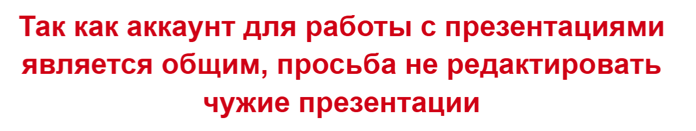

# Итоги занятия 03.05.26

- Начали обговаривать работу на проектами и научились редактировать презентации:
- Научились редактировать текст, изменять цвет, размер и расположение
- Заполнили вступительный слайд
- Обговорили, продумали и записали цель и задачи проекта
- Вспомнили какие инструменты мы используем и будем использовать для достижения поставленной цели, и также заполнии соответствующий слайд
- Научились делать скриншоты экрана, вставлять их в презентацию, обрезать ненужное, и настраивать размер

---

---

# ДЗ №27 (с 03.05.26 до 10.05.26)

---

---

### Задание №1 - Level-дизайн

Далее вам остается только настраивать уровни с помощью редактора. Напомню:
- Чтобы включить редактор нужно нажать на `Enter`
- Выбор объектов для установки на стрелочки `вправо` и `влево`
- В режиме редактора мы можете летать и не взаимодейтсвуете с объектами
- Чтобы выключить редактор нужно снова нажать на `Enter`
- Чтобы "сохранить" уровень, нужно скопировать команды в консоли в класс `LevelLoader`

Также вы можете добавлять свои "Текстуры" для объектов добавляя их в соответсвующие папки:
- `decorations` - папка со спрайтами обычных декораций
- `hazards` - папка со спрайтами объектов, которые наносят урон
- `physical_decorations` - папка со спрайтами декораций c которыми можно взаимодействовать
- `platform` - папка со спрайтами платформ

Вы можете поменять задний фон. Для этого:
- Найдите нужное вам изображение
- Добавьте его в папку `background` и переименнуюйте в `background.png`
- При этом размер игрового окна будет подстаиваться под размер изображения фона

---

---

### Задание №2 - Работа с презентацией
Для работы над презентацией необходимо:

1. Перейти на сайт: https://workspace.google.com/intl/ru/products/slides/
2. Войти в аккаунт, используя:
   a. Логин: `coddyga@gmail.com`
   b. Пароль: `gaCoddy12345`
3. Найти свою презентацию по названию:
   - Катков Иван - `Валентин_JV16_Ваня`
   - Петров Даниил - `Валентин_JV16_Даня`
   - Хапилов Илья - `Валентин_JV16_Илья`
   - Щербинин Богдан - `Валентин_JV16_Богдан`
4. Добавить скриншоты кода и запущенной игры на слайды с номерами 4 и 5. Также вы можете добавить скриншоты из своего `GitHub`, где искали текстуры или как их сами создавали

Памятка по работе с презентацией: https://disk.yandex.com/i/GsFbpLmRfsmmuQ
