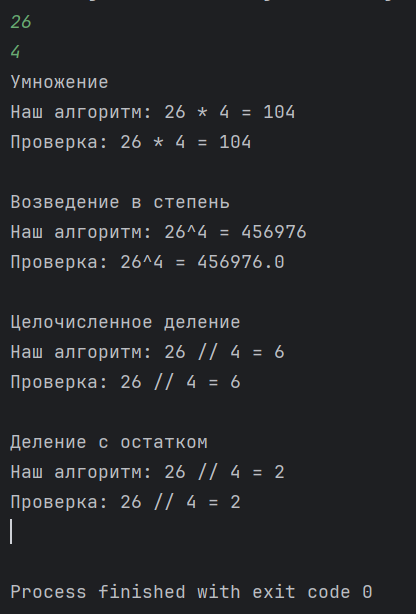

# ДЗ №3 (с 05.10.25 до 12.10.25)

---

---

### Задание №1

В этот раз задание будет нацелено больше на повторения структуры циклов и немного математики

В задание реализуем:

- **Умножение**
- **Возведение в степень**
- **Целочисленное деление**
- **Деление с остатком**

---

Все математические операции мы будет выполнять с двумя переменными: `a` и `b`

Не забываем импортировать (подключить) _Scanner_ для считывания чисел с консоли

```Java
import java.util.Scanner;
```

```Java
// Ввод данных
Scanner scanner = new Scanner(System.in);

int a = scanner.nextInt();
int b = scanner.nextInt();
```

---

##### Умножение

Умножение - это простая запись многократного сложения, например:

5 + 5 + 5 = 15 - мы сложили 5 три раза, это длинная запись, которую можно записать проще

5*3 = 15 - т.е. 5 - это то, что мы складываем, а 3 - сколько раз

Отталкиваясь от этого, реализуем умножение через сложение с помощью цикла. В результате мы должны получить `a`*`b`

Результат, мы будем записывать в переменную `add_result`. Сделаем ее равной нулю. Почему? Если мы к какому-то числу
прибавим 0, то число не изменится, т.е. в сложении 0 не играет роли. И будет получаться следующее:

`add_result` = `0` + `a` + `a` + ... + `a` = `0` + `a` * `b` = `a` * `b`

```Java
int add_result = 0;
```

Теперь нам нужно к нашей переменной `add_result` `b` раз прибавить `a` с помощью цикла

```Java
for(int i = 0; i<b; i++){
    add_result = add_result + a;
}
```

Разберем цикл:

- `int i = 0;` - инициализируем числовую переменную `i`, с помощью которой будем определять, сколько операций сложения
  мы выполнили - счетчик
- `i < b;` - условие. Пока оно выполняется (т.е. `True`), наш цикл будет выполняться
- `i++` - условие по которому будет изненяться наш счетчик `i`. В данном случае `i++` - это тоже самое, что `i = i + 1`,
  т.е. на каждом этапе цикла (итерация) `i` будет увеличиваться на 1

Работа цикла:

Пусть `a` равно 3, `b` равно 4, тогда:

- 1 итерация
    - `i = 0`
    - `i < b` -> `0 < 4` -> верно (`True`)
    - Сложение
      - `add_result = 0`
      - `add_result = add_result + 3`
      - `add_result = 0 + 3`
      - `add_result = 3`
    - `i++` - прибавляем к `i` единицу
- 2 итерация
    - `i = 1`
    - `i < b` -> `1 < 4` -> верно (`True`)
    - Сложение
      - `add_result = 3`
      - `add_result = add_result + 3`
      - `add_result = 3 + 3`
      - `add_result = 6`
    - `i++`
- 3 итерация
  - `i = 2`
  - `i < b` -> `2 < 4` -> верно (`True`)
  - Сложение
    - `add_result = 6`
    - `add_result = add_result + 3`
    - `add_result = 6 + 3`
    - `add_result = 9`
  - `i++`
- 4 итерация
  - `i = 3`
  - `i < b` -> `3 < 4` -> верно (`True`)
  - Сложение
    - `add_result = 9`
    - `add_result = add_result + 3`
    - `add_result = 9 + 3`
    - `add_result = 12`
  - `i++`
- 5 итерация
  - `i = 4`
  - `i < b` -> `4 < 4` -> ложь (`Fasle`) - 4 равно 4, а не меньше
  - Цикл заканчивает работу

Цикл отработал так, как мы запланировали, он сложин тройку 4 раза, т.е. мы сделали 3*4 = 12: `add_result = 12`

Для проверки, мы можем использовать встроенное в Java умножение: `a*b`

Выведем получившийся результат и проверку в консоль:

```Java
System.out.println("Умножение");
System.out.printf("Наш алгоритм: %s * %s = %s\n", a, b, add_result);
System.out.printf("Проверка: %s * %s = %s\n\n", a, b, a * b);
```

---

##### Возведение в степень

Возведение в степень - аналогично умножению, но это простая запись многократного умножения, например:

5^4 = 5 * 5 * 5 * 5 - пять в 4 степени, это перемножение пяти 4 раза

Реализуем возведение в степень с помощью цикла, как делали это при реализации умножения. Результат будем записывать в переменную

```Java
int mult_result = 1;
```

Цикл выглядит также, как предыдущий, но вместо сложения внутри циклы, будем использовать умножение

```Java
for (int i = 0; i < b; i++) {
    mult_result = mult_result * a;
}
```

Для проверки нужно использовать библиотеку с математическими операциями `Math`, для этого импортируем ее:

```
import java.lang.Math;
```

Вывод в консоль:

```Java
System.out.println("Возведение в степень");
System.out.printf("Наш алгоритм: %s^%s = %s\n", a, b, mult_result);
System.out.printf("Проверка: %s^%s = %s\n\n", a, b, Math.pow(a, b));
```

---

##### Целочисленное деление

Вспомним, что это такое:

Представим, что у вас с другом есть 5 яблок, и вы хотите поделить их поровну.

Кадый возьмет по 2 целых яблока, и одно яблоко вы порежете пополам, т.е. `5/2 = 2.5` (тут `2` - 2 целых яблока, а `.5` - половинка)

Другие примеры:
- `10/3 = 3.3` - 3 целых, и .3 - какая-то нецелая часть
- `6/5 = 1.2`

Целочисленное деление просто откидывает нецелую часть, и оставляет только целую. В Java как такового целочисленного деления нет, но если вы делите `int` на `int`, то выполняется целочисленное деление

- `10/3 = 3`
- `6/5 = 1`

Если описать это проще, то целочисленное деление показывает, сколько целых частей в том, что вы делете

Зарберемся, как это это можно реализовать с помощью цикла:

Нужно найти результат целочисленного деления `a` на `b`. Будем вычитать из `a` значение `b`, пока это возможно, т.е. пока `a > b`, и запоминать, сколько раз мы сделали вычетание

Чтобы потом сделать проверку, скопируем значение переменной `a` в новую переменную `a_copy` (_copy_ с английского "копия", "копировать")

```Java
int a_copy = a;
```

Количесво вычетаний будем записывать в переменную `int_div_result` - счетчик

```Java
int int_div_result = 0;
```

Цикл:

```Java
while (a_copy > b) {
    a_copy = a_copy - b;
    int_div_result += 1;
}
```

Разберем цикл:

- `a_copy > b` - условие. Пока оно выполняется (т.е. `True`), наш цикл будет выполняться
- `a_copy = a_copy - b;` - на каждой итерации вычетаем из `a` значение переменной `b`
- `int_div_result += 1;` - прибавляем 1 к нашему счетчику

Работа цикла:

Пусть `a_copy` равно 11, `b` равно 3, тогда:

- 1 итерация
    - `a_copy > b` -> `11 > 3` -> верно (`True`)
    - Вычетание
        - `a_copy = 11`
        - `a_copy = a_copy - 3`
        - `a_copy = 11 - 3`
        - `a_copy = 8`
    - Счетчик
      - `int_div_result = 0`
      - `int_div_result += 1;`
      - `int_div_result = 1`
- 2 итерация
    - `a_copy > b` -> `8 > 3` -> верно (`True`)
    - Вычетание
        - `a_copy = 8`
        - `a_copy = a_copy - 3`
        - `a_copy = 8 - 3`
        - `a_copy = 5`
    - Счетчик
        - `int_div_result = 1`
        - `int_div_result += 1;`
        - `int_div_result = 2`
- 3 итерация
    - `a_copy > b` -> `5 > 3` -> верно (`True`)
    - Вычетание
        - `a_copy = 5`
        - `a_copy = a_copy - 3`
        - `a_copy = 5 - 3`
        - `a_copy = 2`
    - Счетчик
        - `int_div_result = 2`
        - `int_div_result += 1;`
        - `int_div_result = 3`
- 4 итерация
    - `a_copy > b` -> `2 > 3` -> -> ложь (`Fasle`) - 2 меньше 4, а не больше
    - Цикл заканчивает работу

Цикл отработал так, как мы запланировали, он вычислил, что в 11 тройка содержится 3 раза: `int_div_result = 3`

Вывод в консоль:

```Java
System.out.println("Целочисленное деление");
System.out.printf("Наш алгоритм: %s // %s = %s\n", a, b, int_div_result);
System.out.printf("Проверка: %s // %s = %s\n\n", a, b, a / b);
```

---

##### Деление с остатком

Вспомним, что это такое:

Представим, что у вас есть 13 яблок, и у вас 3 друга, с которыми вы хотите разделить эти яблоки поровну, но так, чтобы каждый забрал себе только целые яблоки, а оставшиеся яблоки, вы просто оставите в миске

Всего вас 4 человека (вы и 3 друга), яблок 13, т.е. каждый получит по 3 яблока, и одно останется в миске.

Можно это представить математической формулой: `13 = 3*4 + 1` - из 13 яблок, по 3 заберет 4 человека и одно останется в миске

Так вот, деление с остатком показывает, сколько "осталось в миске", например:

- `9 = 4*2 + 1` -> если мы 9 разделим на 2, получим 4, и остаток 1
- `21 = 3*6 + 3` -> 21 делим на 6, получаем 3, и остаток 3

В Java деление с остатком реализуется с помощью оператора `%`

- `9 % 2 = 1`
- `21 % 6 = 3`

Попробуем реализовать с помощью цикла. За основу возьмем предыдущий цикл, но убрем счетчик, и в конце просто проверим, что у нас осталось после многократного вычетания.

Чтобы потом сделать проверку, скопируем значение переменной `a` в новую переменную `rem_div_result`

```Java
int rem_div_result = a;
```

Цикл:

```Java
while (rem_div_result > b) {
    rem_div_result = rem_div_result - b;
}
```

Вывод в консоль с проверкой:

```Java
System.out.println("Деление с остатком");
System.out.printf("Наш алгоритм: %s // %s = %s\n", a, b, rem_div_result);
System.out.printf("Проверка: %s // %s = %s\n\n", a, b, a % b);
```

---

##### Программа целиком:

```Java
import java.util.Scanner;
import java.lang.Math;

public class Main {
    public static void main(String[] args) {
        // Ввод данных
        Scanner scanner = new Scanner(System.in);

        int a = scanner.nextInt();
        int b = scanner.nextInt();

        // Умножение через сложение
        int add_result = 0;

        for (int i = 0; i < b; i++) {
            add_result = add_result + a;
        }

        System.out.println("Умножение");
        System.out.printf("Наш алгоритм: %s * %s = %s\n", a, b, add_result);
        System.out.printf("Проверка: %s * %s = %s\n\n", a, b, a * b);

        // Возведение в степень
        int mult_result = 1;

        for (int i = 0; i < b; i++) {
            mult_result = mult_result * a;
        }

        System.out.println("Возведение в степень");
        System.out.printf("Наш алгоритм: %s^%s = %s\n", a, b, mult_result);
        System.out.printf("Проверка: %s^%s = %s\n\n", a, b, Math.pow(a, b));

        // Целочисленное деление
        int a_copy = a;
        int int_div_result = 0;

        while (a_copy > b) {
            a_copy = a_copy - b;
            int_div_result += 1;
        }

        System.out.println("Целочисленное деление");
        System.out.printf("Наш алгоритм: %s // %s = %s\n", a, b, int_div_result);
        System.out.printf("Проверка: %s // %s = %s\n\n", a, b, a / b);

        // Деление с остатком
        int rem_div_result = a;

        while (rem_div_result > b) {
            rem_div_result = rem_div_result - b;
        }

        System.out.println("Деление с остатком");
        System.out.printf("Наш алгоритм: %s // %s = %s\n", a, b, rem_div_result);
        System.out.printf("Проверка: %s // %s = %s\n\n", a, b, a % b);
    }
}
```

---

---

##### Что нужно вспомнить и запомнить, выполняя это задание:

- Структуру цикла `for`
- Структуру цикла `while`
- Основное отличие `while` от `for`
- Операторы математических операций:
  - `+` - сложение и `-` - вычетание
  - `*` - умножение
  - `/` - целочисленное деление (просто деле)
  - `%` - деление с остатком
- Понять, что такое целочисленное деление и деление с остатком

##### Что должно получиться:

После запуска программы введите 2 числа в консоль и посмотрите результаты



