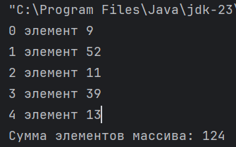
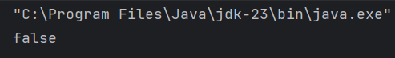
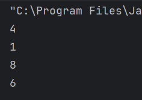

# ДЗ №5 (с 19.10.25 до 26.10.25)

---

---

### Задание №1

Вам дан массив `mas` из пяти целоцисленных (`int`) элементов:

```Java
int[] mas = new int[5];
```

При инициализации массива таким образом все его элементы равные 0

Зададим 2 и 4 элементы. Напоминаю, что нумерация элементов в массиве начинается с `0`, т.е.:
- **Первый** элемент находится на `0` позиции
- **Второй** на `1` позиции
- **Третий** на `2` позиции
- и так далее

```Java
mas[1] = 52;
mas[3] = 39;
```

**Ваша задача:** задать **первый**, **третий** и **пятый** элементы

После того, как все элементы массива заданы выведем их в консоль:

```Java
for (int i = 0; i < mas.length; i++) {
    System.out.printf("%s элемент %s\n", i, mas[i]);
}
```

Введем переменную `mas_sum` и в нее запишем сумму элементов массива

```Java
int mas_sum = 0;
```

Чтобы посчитать сумму, нужно использовать цикл `for` (**Подсказка:** параметры цикла должны быть такими же, как при выводе значений массива в консоль):

```Java
for (Параметры) {
    Считаем сумму, как на предыдущих занятиях
}
```

После вычислений сделаем вывод в консоль результата:

```Java
System.out.printf("Сумма элементов массива: %s\n", mas_sum);
```


--- 

##### Итоговый код, который вы должны дописать:

- Нужно задать **первый**, **третий** и **пятый** элементы
- Нужно посчитать сумму элементов

```Java
public class Main {
    public static void main(String[] args) {
        int[] mas = new int[5];
        mas[1] = 52;
        mas[3] = 39;
        // Задаем первый элемент
        // Задаем третий элемент
        // Задаем пятый элемент
        
        for (int i = 0; i < mas.length; i++) {
            System.out.printf("%s элемент %s\n", i, mas[i]);
        }

        int mas_sum = 0;
        
        // Считаем сумму элементов массива с помощью цикла
        for (...) {
            ...
        }

        System.out.printf("Сумма элементов массива: %s\n", mas_sum);
    }
}
```

--- 

##### Результат

После запуска программы в консоли должно получиться следующее:




_Значения заданные вами элементов могут отличаться от моих_

---

---

### Задание №2

Вам дан массив `mas_1` из нескольких целоцисленных элементов, переданных через фигурные скобки: `{...}`

```Java
int[] mas_1 = new int[] {6, 4, 3, 1, -10, 15, 12};
```

**Ваша задача**: Создать еще один массив с названием `mas_2` аналогичным образом (т.е. через фигурные скобки)

После того, как вы создадите массив `mas_2`, мы проверим равен ли он массиву `mas_1`, используя встроенные класс `Arrays`. Для этого в начале программы нужно сделать `import`:

```Java
import java.util.Arrays;
```

а в программе написать:

```Java
System.out.println(Arrays.equals(mas_1, mas2));
```

---

##### Итоговый код, который вы должны дописать:

Нужно создать еще один массив с названием `mas_2` и заполнить его значения через фигурные скобки `{...}`

```Java
import java.util.Arrays;

public class Main {
    public static void main(String[] args) {
        int[] mas_1 = new int[] {6, 4, 3, 1, -10, 15, 12};
        // Инициализируем массив mas_2 через фигурные скобки {}

        System.out.println(Arrays.equals(mas_1, mas_2));
    }
}
```

---

##### Результат

После запуска программы в консоли должно получиться следующее:



В данном случае `false` означает, что массив `mas_2` не равен `mas_1`. Если бы массивы были равны, то в консоли отобразилось бы `true`

---

---

### Задание №3

Вам задан двумерный массив (т.е. массив содержащий другие массивы) `double_mas`:

```Java
int[][] double_mas = new int[][] {
        {1, 4, 7},
        {2, 5, 8},
        {3, 6, 9},
};
```

Выведем **второй элемент** из **первого подмассива**

```Java
System.out.println(double_mas[0][1]); // 2 элемент из 1 подмассива
```

**Ваша задача**: вывести еще несколько значений

---

##### Итоговый код, который вы должны дописать:

Нужно вывести:
- 1 элемент из 1 подмассива
- 3 элемент из 2 подмассива
- 2 элемент из 3 подмассива

```Java
public class Main {
    public static void main(String[] args) {
        int[][] double_mas = new int[][] {
                {1, 4, 7},
                {2, 5, 8},
                {3, 6, 9},
        };

        System.out.println(double_mas[0][1]);
        // Вывести 1 элемент из 1 подмассива
        // Вывести 3 элемент из 2 подмассива
        // Вывести 2 элемент из 3 подмассива
        
    }
}
```

--- 

##### Результат

После запуска программы в консоли должно получиться следующее:



---

---

### Как будет выглядеть программа:

Если вы каждую программу пишете, как отдельную, то должно получиться 3 программы:

1 задание
```Java
public class Main {
    public static void main(String[] args) {
        int[] mas = new int[5];
        mas[1] = 52;
        mas[3] = 39;
        // Задаем первый элемент
        // Задаем третий элемент
        // Задаем пятый элемент
        
        for (int i = 0; i < mas.length; i++) {
            System.out.printf("%s элемент %s\n", i, mas[i]);
        }

        int mas_sum = 0;
        
        // Считаем сумму элементов массива с помощью цикла
        for (...) {
            ...
        }

        System.out.printf("Сумма элементов массива: %s\n", mas_sum);
    }
}
```
2 задание
```Java
import java.util.Arrays;

public class Main {
    public static void main(String[] args) {
        int[] mas_1 = new int[] {6, 4, 3, 1, -10, 15, 12};
        // Инициализируем массив mas_2 через фигурные скобки {}

        System.out.println(Arrays.equals(mas_1, mas_2));
    }
}
```
3 задание
```Java
public class Main {
    public static void main(String[] args) {
        int[][] double_mas = new int[][] {
                {1, 4, 7},
                {2, 5, 8},
                {3, 6, 9},
        };

        System.out.println(double_mas[0][1]);
        // Вывести 1 элемент из 1 подмассива
        // Вывести 3 элемент из 2 подмассива
        // Вывести 2 элемент из 3 подмассива
    }
}
```

Если вы пишете все задания в одну программу, должно получиться так:

```Java
import java.util.Arrays;

public class Main {
    public static void main(String[] args) {
        int[] mas = new int[5];
        mas[1] = 52;
        mas[3] = 39;
        // Задаем первый элемент
        // Задаем третий элемент
        // Задаем пятый элемент

        for (int i = 0; i < mas.length; i++) {
            System.out.printf("%s элемент %s\n", i, mas[i]);
        }

        int mas_sum = 0;

        // Считаем сумму элементов массива с помощью цикла
        for (...) {
            ...
        }

        System.out.printf("Сумма элементов массива: %s\n", mas_sum);
        
        int[] mas_1 = new int[] {6, 4, 3, 1, -10, 15, 12};
        // Инициализируем массив mas_2 через фигурные скобки {}

        System.out.println(Arrays.equals(mas_1, mas_2));

        int[][] double_mas = new int[][] {
                {1, 4, 7},
                {2, 5, 8},
                {3, 6, 9},
        };

        System.out.println(double_mas[0][1]);
        // Вывести 1 элемент из 1 подмассива
        // Вывести 3 элемент из 2 подмассива
        // Вывести 2 элемент из 3 подмассива
    }
}
```

---

### Что нужно вспомнить, чтобы выполнить задание:
- Инициализацию массивы
- Как задавать значения элементов массива
  - Через `{}` при инициализации
  - Через `[]` после инициалиции
- Как использовать значения элементов (через `[]`)
- Индексацию (номера) элементов в массиве
- Параметры цикла `for`
- Что делает `mas.length`