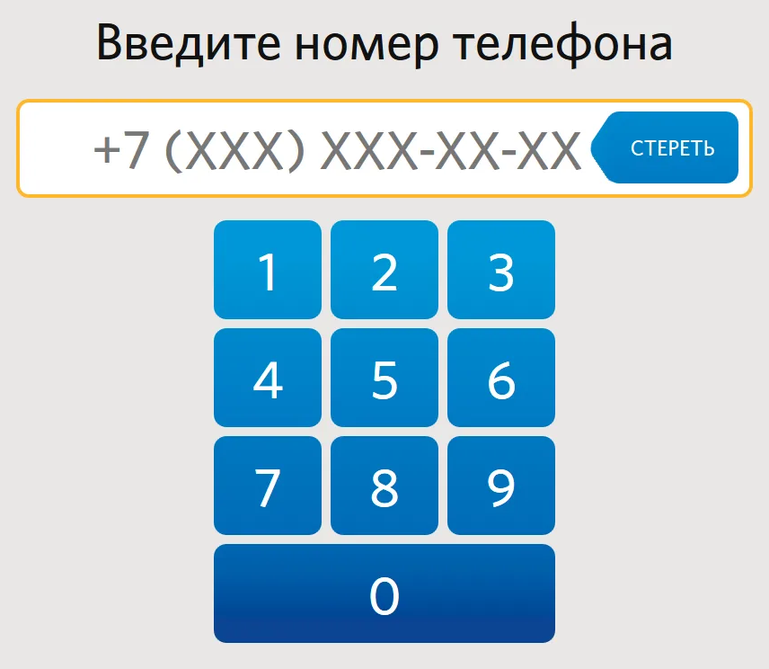

# ДЗ №6 (с 26.10.25 до 02.11.25)

---

---

### Задание №1

Задание нацелено на дополнительный разбор, того как утроены наши "Крестики-Нолики", написанные на занятии

---

##### Поле

Поле в "Крестиках-Ноликах" - это 9 клеток квадрата 3 на 3


Поэтому нам удобно задать все клетки поля с помощью двумерного массива 3 на 3 (т.е. в массиве 3 подмассива по 3 элемента), где:
- `0`-вой подмассив - первая строка
- `1`-ый - вторая
- `2`-ой - третья

```java
int[][] board = new int[][] {
        {2, 2, 2},
        {2, 2, 2},
        {2, 2, 2}
};
```

Почему все целочисленные элементы массива равны `2`? Это сделано для того, чтобы в будущем нам было проще заполнять поле в зависимости от хода игрока (походил "крестик" или "нолик")

---

##### Игра

Т.к. поле состоит из 9 клеток, то максимум игроки смогут сделать суммарно 9 ходов, поэтому нам удобно использовать цикл `for` с 9 итерациями

```java
for(int i = 0; i < 9; i++) {
    // Обработка ходов
}
```

---

##### Игрок

Т.к. в игре всего два игрока и их очередность ходов всегда идет друг за другом: крестик - нолик - крестик - нолик - ...

То нам удобно "привязать" ход игрока к итерации цикла. Это можно спокойно сделать задав следующее соответсвие:
- Пусть крестик - это `0`, а нолик - `1`
- Тогда последовательность ходов: `0`, `1`, `0`, `1`, `0`, `1`, `0`, `1`, `0`
- Такую последовательность ходов можно задать делением с остатком - мы будем делить номер итерации цикла `i` с остатком на `2`
- При i:
  - `0` -> ходит `0%2` = `0` - крестик
  - `1` -> ходит `1%2` = `1` - нолик
  - `2` -> ходит `2%2` = `0` - крестик
  - `3` -> ходит `3%2` = `1` - нолик
  - `4` -> ходит `4%2` = `0` - крестик
  - `5` -> ходит `5%2` = `1` - нолик
  - `6` -> ходит `6%2` = `0` - крестик
  - `7` -> ходит `7%2` = `1` - нолик
  - `8` -> ходит `8%2` = `0` - крестик

В коде просто зададим переменную `player`, которая будет рассчитывать на каждой итерации цикла игры

```java
for(int i = 0; i < 9; i++) {
    int player = i%2;
}
```

---

##### Вывод поля в консоль

Чтобы игроки могли понимать, кто куда походил, на каждой итерации цикла игры будет выводить состояние поля

Т.к. поле у нас задано двумерным массивом 3на3, то вывести все элементы удобно используя два вложенных цикла `for`:

```java
for(int j = 0; j < 3; j++) {
    for (int k = 0; k < 3; k++) {
            // Вывод
        }
    }
}
```

Для поля мы уже ввели все необходимые обозначения:
- `0` - в клетку походил крестик
- `1` - походил нолик 
- `2` - в эту клетку ище никто не походил

Т.к. игроки - реальные люди, а не компьютер, то им удобно смотреть на пустые клетки, крестики и нолики, а не на непонятные наборы чисел от 0 до 2, поэтому используя `switch - case`, будем выводить необходимый символ в зависимости от числа в клетке

```java
for(int j = 0; j < 3; j++) {
    for (int k = 0; k < 3; k++) {
        switch(board[j][k]) {
            case 0 -> System.out.print("X");
            case 1 -> System.out.print("O");
            default -> System.out.print(" ");
        }
    }
}
```

В качестве параметра в `switch` мы подставляем элемент двумерного массива `board[j][k]`, где:
- `j` - номер строки
- `k` - номер элемента в строке

Сначала циклы выводят элементы первой строки друг за другом, потом второй и в конце третей без пробелов и переноса на другую строку, потому что мы используем `print`, а не `println` (добавляет в конец перенос на новую строку)

Чтобы разделить строки добавим перенос на следующую строку после вывода всех элементов строки, т.е. после того как выполнится внутренний цикл

```java
for(int j = 0; j < 3; j++) {
    for (int k = 0; k < 3; k++) {
        switch(board[j][k]) {
            case 0 -> System.out.print("X");
            case 1 -> System.out.print("O");
            default -> System.out.print(" ");
        }
    }
    System.out.println();
}
```

---

##### Нумерация поля

Чтобы упростить игру пользователям, пронумеруем все клетки числами от 1 до 9, как при вводе номера телефона



---

##### Ход игрока

Будем выводить пользователям, кто сейчас ходит в зависимости от переменной `player`

```java
System.out.print("Сейчас ходит: ");
if (player == 0) {
    System.out.println("Крестик (X)");
} else {
    System.out.println("Нолик (O)");
}
```

После чего запрашиваем игрока ввести номер клетки поля

```java
int pos = scanner.nextInt();
```

Проверяем, что игрок ввел именно число от 1 до 9 (номер ячейки)

```java
if (pos < 1 || pos > 9) {
    // Что будет, если введенное число мельше 1 или больше 9
}
```

Если игрок ввел неверное число, то нужно:
- Предупредить игрока об этом сообщением в консоль
- "Перезапустить" итерацию цикла, чтобы игрок не потерял свой ход

```java
if (pos < 1 || pos > 9) {
    System.out.println("Вы ввели неверный номер позиции клетки поля, нужно ввести число от 1 до 9");
    i--;
    continue;
}
```

Для чего `i--`:

- `i` - это числовая переменная в которой хранится номер итерации цикла игры
- Когда выполнится оператор `continue`, мы пропускаем весь код ниже и переходим к следующей итерации
- Но если мы перейдем к следующей итерации, то поменяется ход игрока, поэтому игрок, который ввел неверное число пропустик ход, а такого не может быть
- Для того чтобы этого избежать, мы делаем `i--` - уменьшаем номер итерации на `1`, а выполняя `continue`, посути, выполяется `i++` - увеличение итерации на `1`
- Послечается, что мы уменьшили номер итерации, увеличили номер итерации и по итогу остались на тойже итерации цикла, и игрок не пропустил свой ход

Чтобы дальше удобно обработать введенное число, нужно вычесть из него `1`

```java
pos--;
```

Проверим, что игрок может походить в указанную ячейку - т.е. в массиве на этом месте стоит `2`, если нет - то "перезапустим" итерацию:

```java
if (board[pos/3][pos%3] != 2) {
    System.out.println("Это поле занято");
    i--;
    continue;
}
```

Как работает `board[pos/3][pos%3]`? - магия математики и программирования:

- `pos/3` - целочисленное деление на 3 - это номер строки
- `pos%3` - деление на 3 с остатком - номер элеметра
- Пока что просто проверим:

| pos | pos/3 | pos%3 |
|-----|-------|-------|
| 0   | 0     | 0     |
| 1   | 0     | 1     |
| 2   | 0     | 2     |
| 3   | 1     | 0     |
| 4   | 1     | 1     |
| 5   | 1     | 2     |
| 6   | 2     | 0     |
| 7   | 2     | 1     |
| 8   | 2     | 2     |

|          | 0 элемент   | 1 элемент   | 2 элемент   |
|----------|-------------|-------------|-------------|
| 0 строка | board[0][0] | board[0][1] | board[0][2] |
| 1 строка | board[1][0] | board[1][1] | board[1][2] |
| 2 строка | board[2][0] | board[2][1] | board[2][2] |
- Действительно совпадает - мы преобразовали номер ячейки в номер строки и номер элемента в массиве

Если все верно, то просто записываем в массив "номер" игрока

```java
board[pos/3][pos%3] = player;
```

---

##### Конец игры

После того, как игроки в сумме сделали 9 ходов, нужно вывести итоговое игровое поле

Просто скопируем вывод поля (используйте комбинации клавиш `Ctrl+C` - скопировать, `Ctrl+V` - вставить)

```java
for(int j = 0; j < 3; j++) {
    for (int k = 0; k < 3; k++) {
        switch(board[j][k]) {
            case 0 -> System.out.print("X");
            case 1 -> System.out.print("O");
            default -> System.out.print(" ");
        }
    }
    System.out.println();
}
```

---

##### Итоговый код

```java
import java.util.Scanner;

public class Main {
    public static void main(String[] args) {
        Scanner scanner = new Scanner(System.in);

        int[][] board = new int[][] {
                {2, 2, 2},
                {2, 2, 2},
                {2, 2, 2}
        };

        for(int i = 0; i < 9; i++) {
            int player = i%2;

            for(int j = 0; j < 3; j++) {
                for (int k = 0; k < 3; k++) {
                    switch(board[j][k]) {
                        case 0 -> System.out.print("X");
                        case 1 -> System.out.print("O");
                        default -> System.out.print(" ");
                    }
                }
                System.out.println();
            }

            System.out.print("Сейчас ходит: ");
            if (player == 0) {
                System.out.println("Крестик (X)");
            } else {
                System.out.println("Нолик (O)");
            }
            
            int pos = scanner.nextInt();

            if (pos < 1 || pos > 9) {
                System.out.println("Вы ввели неверный номер позиции клетки поля, нужно ввести число от 1 до 9");
                i--;
                continue;
            }
            pos--;

            if (board[pos/3][pos%3] != 2) {
                System.out.println("Это поле занято");
                i--;
                continue;
            }

            board[pos/3][pos%3] = player;
        }

        for(int j = 0; j < 3; j++) {
            for (int k = 0; k < 3; k++) {
                switch(board[j][k]) {
                    case 0 -> System.out.print("X");
                    case 1 -> System.out.print("O");
                    default -> System.out.print(" ");
                }
            }
            System.out.println();
        }
    }
}
```

---

---


### Дополнительное задание

В нашей реализации не учитывается выйгрыш игрока, т.к. у нас нет проверки на то, что после хода игрока тот выйграл - это чуть больше математических размышлений и кода (приблизительно столько же, сколько сейчас есть)

Но над этим можно подумать дома самостоятельно - за предложения, как это проверять, - доп баллы, если даже они не полностью реализуют проверку