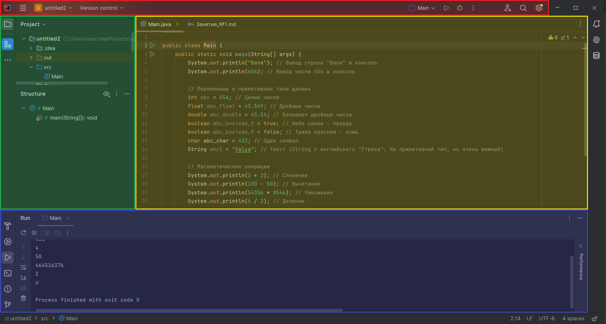

# Занятие №1 (14.09.25)

На занятии мы:
- Ознакомились со **средой разрабтки**
- Научились выводить данные в **консоль**;
- Изучили, что такое **переменная** и как ее **объявить**;
- Изучили и разобрались с основными **примитивными типами данных**;
- Вспомнили основные **математические операции**;
- Научились выводить **данные записанные в переменные в консоль**;
- Начали формировать **список правил языка программирования** - синтаксис

---

---

## Среда разработки
**Среда разработки (IDE, Integrated Development Environment)** — это народ различных программных средств, используемый программистами для разработки. IDE объединяет множество необходимых инструменты для программирования в одном месте, что делает разработку проще и быстрее, потому что не нужно переключаться между разными программами и файлами.

---

В качестве IDE в нашем курсе _разработки игр на Java_ мы используем **IntelliJ IDEA** от компании JetBrains


---

Наша среда разработки делится на 4 основых блока:
- **Настроек** (Красный) - в данном блоке можно найти различные настройки проекта, настройки визуальной составляющей IDE, инструметы для разработки и многое другое 
- **Структуры проекта** (Зеленый) - здесь мы будем добавлять новые файлы, папки, пакеты и др.
- **Основой** (Желтый) - именно в этом блоке мы будем писать код, добавлять новые методы и править ошибки
- **Консоль** (Синий) - сюда мы будем выводить результаты обработки наших данных и вводить другие данные



---

---

## Вывод в консоль

Для вывода данных в консоль используется следующая команда:
```
System.out.println(...);
```
где вместо "..." необходимо указать то, что мы хотим вывести - какое-то значение, переменную и тп

Например, мы хотим вывести в консоль числовое значение записанное в переменную `abc`:
```
int a = 1234;
System.out.println(a);
```
После выполнения программы в консоли мы увидим значение переменной `a` - `1234`

---

---

## Переменные

**Переменная** — это именованная область памяти, которая хранит наши данные, которые можно посмотреть, изменить или удалить

Переменные можно сравнить с полками в шкафу - в них можно что-то **положить**; открыть и **посмотреть**, что в них лежит; **вытащить** из них все; **доложить** в них; или **положить что-то другое**. Но обязательное условие такого шкафа - все полки должны быть как-то названы


Для того чтобы объявить переменную нужно:
- Указать ее **тип***
- Дать переменной **название**

```
String name = "Valentin";
int age = 456;
```

---

---

## Типы данных

**Примитивные типы данных в Java** — это базовые элементы, которые используются для хранения простых значений. Они не являются _объектами_* и не имеют _методов_*

Примитивные типы:
- **int** - целые чиста: `412`, `0`, `-53`
- **float** - дробыне числа: `-4.54`, `0.01`, `10.5`
- **boolean** - логическая переменная: `true` (правда) или `false` (ложь)
- **char** - один символ: `'f'`, `'ъ'`, `'ư'`

Также мы разобрали тип **String**, который не является примитивным, но относится к основным:
- **String** - текст: `"Hello, CODDY!"`, `"Программа завершила работу"`

---

---

## Математические операции

В любом языке программирования есть простые математические операции:
- **Сложение**: `2 + 2`
- **Вычетание**: `100 - 50`
- **Умножение**: `12 * 8`
- **Деление**: `4 / 2`

## Синтаксис
**Синтаксис** - это набор правил, которые определяют структуру и формат кода на языке программирования.

На занятии мы обратили внимение на:
- Все строкчи кода должный заканчиватся `;` (точка с запятой)

```
System.out.println(456);
int abc = 456;
```

- Должно соблюдаться точное написание в верхнем (заглавные буквы) и нижнем (строчные буквы) регистре

Если мы хотим сделать вывод в консоль, мы не можем написать команду с маленькой буквы или заменить строчные буквы на заглавные

```
system.out.println(...); - Так нельзя
System.Out.Println(...); - Так тоже нельзя
System.out.println(...); - Можно только так
```

- Для того чтобы задать значения переменной типа `float` после самого значения необходимо дописать букву `f`

```
float abc_float = 43.54f;
```

- Строки должны быть написаны в кавычках `" "`

```
System.out.println("Валентин");
String abc_string = "Valentin";
```

Данный список будет расширяться по мере прохождения курса